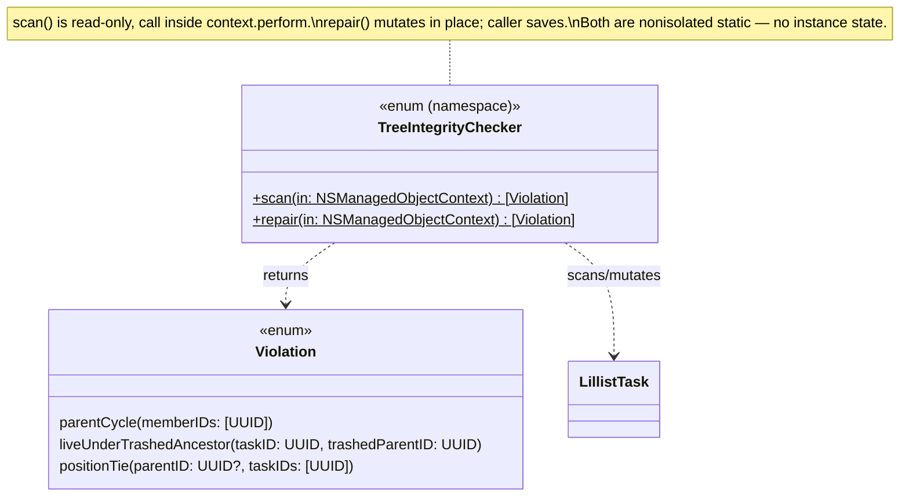

# Plan 1a — Trash/Restore Tree Integrity

**Program:** [Data & Sync Hardening](2026-07-28-data-sync-hardening-index.md), Wave 1, plan `1a`.
**Findings:** `C1` `C2` `C3` `H4` `H7` `M1` `M2` `M5` (stories `LIL-7` `LIL-8` `LIL-9` `LIL-22` `LIL-25` `LIL-45` `LIL-46` `LIL-49`).
**Source review:** [`docs/reviews/2026-07-28-data-sync-review.md`](../../reviews/2026-07-28-data-sync-review.md).

## Why one plan for eight findings

All eight findings are facets of the same root problem the review names directly: *"The
trash/restore/cascade state machine has no single source of truth for the interaction of
`deletedAt` × `archivedAt` × 'parent is trashed' × parent-child cycles."* Fixing them
independently would mean re-deriving the state machine eight times, inconsistently. This
plan defines the state machine once, fixes every mutation path that can violate it, and adds
a class-killer (`TreeIntegrityChecker`) that repairs violations CloudKit's property-level
merge can still create no matter how well local code guards them.

## The state machine

A `LillistTask` has three axes relevant here: `deletedAt` (nil = live, set = trashed),
`archivedAt` (nil = active, set = archived), and its parent's own trashed-ness. `archivedAt`
and `deletedAt` are independent flags — all four combinations are valid resting states — so
the real defect surface is the *parent* axis and the *transitions* between states, not the
flags themselves.

| `deletedAt` | `archivedAt` | Parent state | Valid? | Notes |
|---|---|---|---|---|
| nil | nil | root, or parent live | ✅ valid | Active task. |
| nil | set | root, or parent live | ✅ valid | Archived, not trashed — visible in the Archive surface. |
| set | nil | root, or parent live | ✅ valid | Trashed leaf/branch; ancestor line above it is untouched (`softDelete(id:)` only cascades *downward*). |
| set | set | root, or parent live | ✅ valid | Was archived, then trashed. |
| set | any | parent trashed with the **same** `deletedAt` stamp | ✅ valid | Cascade-trashed subtree (`applySoftDelete` stamps the whole live subtree with one timestamp). |
| **nil** | any | **parent trashed** | ❌ **invalid — "live-under-trashed"** | `C1`'s victim pool and `C2`'s bug shape. Self-heal / fix-at-origin: **promote the live node to root** (sever `.parent`), per Mikey's binding product decision on `C2`. |
| any | any | **cycle** (`X.parent` reachable from `X` via repeated `.parent`) | ❌ **invalid** | `H7`. CloudKit property-level merge can create this; no local mutation path can (post-`M1`/`H7` fixes). Self-heal: sever one link (council decision, below). |
| set (dup rows) | — | — | ❌ **invalid — duplicate `id`** | `C3`. Two `LillistTask` rows sharing one app-level `id` (CloudKit re-import after a bookkeeping reset). Handled by `TaskDuplicateReconciler`, not `TreeIntegrityChecker` — different repair (merge two rows), not a tree-shape repair. |
| any live siblings | — | two live siblings, same `parent`, identical `position` | ❌ **invalid — position tie** | `H4`. Breaks `SiblingOrder`'s total order for rendering/reorder math. |

**Transitions that must preserve this table** (the fix-at-origin set):

- **Purge** (`C1`): must never delete a live-under-trashed node. Bound the cascade at the
  first live node encountered; promote it to root instead of deleting it.
- **Restore** (`C2`, `M2`, `H4`): the restored node's parent may itself still be trashed —
  promote to root. Must clear `archivedAt` (not just `deletedAt`) so the result is
  unconditionally visible. Must land at a fresh, non-colliding position among its (possibly
  new) live siblings, not keep its stale pre-trash position.
- **Create / reparent / reorder(explicit)** (`M1`): must reject a trashed node as the
  target parent — mirrors the existing soft-deleted-*anchor* guard at `TaskStore.swift:404`,
  extended to the soft-deleted-*parent* case.
- **Duplicate reconcile** (`C3`, `M5`): must re-point the loser's children/journal/
  attachments/notification-specs onto the survivor (not cascade-delete them), field-merge by
  row-level last-write-wins, and never silently swallow a reconcile failure.
- **Every ancestor/descendant walk** (`H7`): needs a visited-set guard so a pre-existing
  cycle (created by any of the above failing, or by CloudKit merge) makes the walk fail loud
  and stop, never spin.

## Per-finding fix design

### C1 — purge must not delete live descendants of a trashed ancestor

`CascadeReaper.objectIDs(forDeleting:)` recurses into every descendant unconditionally,
because — per `docs/engineering-notes.md`'s "Batch delete skips delete rules — and the result
set lies" entry — the model's `children` relationship has `deletionRule="Cascade"`
(`LillistModel.xcdatamodeld/.../contents:21`), and **the SQLite store still cascades that
rule at the row level even for `NSBatchDeleteRequest`**, which bypasses only Core Data's
*in-memory* delete-rule engine, not the store's own FK cascade. Concretely: batch-deleting a
trashed root's row will silently take its live child's row down with it *regardless* of
whether `CascadeReaper` "counted" that child — excluding the live child from the *returned
objectID list* does nothing to stop the DB-level cascade from removing it anyway. The only
way to actually spare it is to **sever the parent link before the batch delete runs**, via a
normal managed-object mutation + save (which nullifies the live child's FK column, so it's no
longer *reachable* by the cascade when the ancestor row is later deleted).

Fix: `CascadeReaper.planPurge(ofTrashedRoots:)` (new) walks each root's descendants and, on
encountering a child with `deletedAt == nil`, stops recursing into it, adds its objectID to a
`liveDescendantsToPromote` set instead of the deletable set, and leaves its own subtree
(live or trashed) untouched — it stays structurally attached to the promoted node. Both
`TaskStore.batchPurge` and `AutoPurgeJob.run` promote every ID in that set to root (`parent =
nil`) and `save()` **before** issuing the batch delete for the (now-correctly-bounded)
deletable set. This also fully closes `C2`'s "feeds `C1`'s victim pool" corroboration: once
`C2` is fixed, restore itself can never re-create a live-under-trashed node, and `C1`'s own
purge is independently safe even if one exists anyway (e.g. from a CloudKit merge or a bug).

### C2 — restore of a cascade-trashed child (binding product decision)

**Mikey, 2026-07-28:** restoring a child whose parent is still trashed **promotes the child
to root**, severing the link to the trashed parent. `TaskStore.restore(id:)`: after clearing
`deletedAt`/`archivedAt` on the target node, if its *own* `parent.deletedAt != nil`, set
`.parent = nil`. Only the top-level restored node needs this check — cascaded descendants
restored alongside it keep pointing at their existing (now-restored) parent, which doesn't
change.

### M2 — restore must clear `archivedAt`

`restore(id:)`'s cascade (`clearSoftDelete`) now clears **both** `deletedAt` and
`archivedAt` on every node it touches (the root plus every cascade-matched descendant) — a
restored subtree must be unconditionally visible, and a descendant that was independently
archived before being swept into a trash cascade should also resurface with the rest of the
subtree.

### H4 — restore must land at a non-colliding position

Two independent fixes:

1. `nextPositionDetail`'s fetch predicate gains `AND deletedAt == nil`, so the edge position
   it observes is always drawn from the *live* sibling set — consistent with
   `recompactSiblings`/`childrenFetchRequest`, which already filter this way. (A trashed
   sibling is logically absent from the ordering domain everywhere else in this file; this
   was the one holdout.)
2. `restore(id:)` no longer keeps the node's stale pre-trash `position`. After resolving the
   final parent (root-promoted per `C2`, or the original live parent), it reassigns position
   via `nextPositionDetail(forParent:placement: .bottom)` — the same helper `create` uses —
   so it always lands beyond the current live siblings, never colliding with one that moved
   into its old slot via recompaction while it was trashed.

### M1 — reject a soft-deleted parent at every write entry point

Mirrors the existing soft-deleted-*anchor* guard (`TaskStore.swift:404`): `create`,
`reparent`, and `reorder`'s parent-resolution step (both `.infer` and `.explicit`, at the
point where a *new* parent assignment is about to be made) now throw
`LillistError.validationFailed([.init(field: "parent", message: "parent is trashed")])`
when the resolved parent has `deletedAt != nil`. This closes the only *local* path that could
create a live-under-trashed node going forward (`C1`'s self-heal + purge-time barrier remain
as defense-in-depth against the CloudKit-merge path, which no local guard can prevent).

### C3 — duplicate reconciler must not destroy the loser's subtree

Before `ctx.delete(loser)`, `TaskDuplicateReconciler.reconcileDuplicates` now:

1. **Re-points** every relationship a `Cascade` delete rule would otherwise sweep away:
   `loser.children` → `child.parent = survivor`; `loser.journalEntries` → `entry.task =
   survivor`; `loser.attachments` → `attachment.task = survivor`; `loser.notificationSpecs`
   → `spec.task = survivor`. After this, `loser` has an empty cascade closure, so deleting it
   destroys nothing but the duplicate row itself.
2. **Field-merges** row-level, last-write-wins on `modifiedAt`: if `loser.modifiedAt` is
   strictly newer than `survivor.modifiedAt` (`nil` treated as `.distantPast`), the loser's
   *content* fields (`title`, `notes`, `status`, `start`/`startHasTime`,
   `deadline`/`deadlineHasTime`, `isPinned`, `closedAt`, `archivedAt`, `deletedAt`) are
   copied onto the survivor; otherwise the survivor's fields stand untouched. This is a
   row-granularity LWW, not true per-property CRDT merge — Core Data has no per-property
   version vector, only one `modifiedAt` per row, so "per property" in practice means "every
   field traces back to whichever *row* was edited more recently," which is honest given
   what the data model actually tracks. **`position` and `parent` are deliberately excluded**
   from the merge and always keep the survivor's own value: these are structural/placement
   fields, not content, and blending them from a different row risks reintroducing exactly
   the position-collision and tree-consistency defects the rest of this plan fixes. Justified
   here per the wave brief's "acceptable; justify in the plan doc" allowance.
3. **Never swallows the outcome** (`M5`): `reconcileNow()` no longer does
   `_ = try? await Self.reconcileDuplicates(...)`. A thrown error now logs unconditionally via
   `LillistLog.store.error(...)` (so it's never silently lost even with no diagnostic sink
   wired) and emits a `DiagnosticEvent` when a sink is present (a new property-injected
   `diagnosticLog: DiagnosticSink?`, mirroring `TaskStore`'s existing pattern).

### H7 — cycle guards on every ancestor/descendant walk

Every walk the review named gets a visited-set (or equivalent) guard so a *pre-existing*
cycle — one the walk didn't create, but merely encounters — terminates the walk instead of
spinning:

- `Validators.wouldCreateCycle(candidate:newParent:)` — tracks visited ancestors while
  walking `newParent.parent`; if the walk revisits a node, that's a pre-existing cycle
  upstream of `candidate` — treat it conservatively as "would create a cycle" (block the
  operation) rather than loop.
- `TaskStore.applySoftDelete`/`clearSoftDelete` — already guarded structurally in the common
  case (they only recurse into children matching a specific `deletedAt` stamp, which a true
  cycle can't satisfy twice), hardened with an explicit visited-objectID set for defense in
  depth against any future recursion shape change.
- `TaskStore+Queries.breadcrumbs(for:)` — walks `cursor = p.parent` with no bound; gains a
  visited-objectID set, stopping (and reporting whatever trail was accumulated so far) if a
  node repeats.
- `RecurrenceSpawner.deepCopy` — recurses into `children` while spawning copies; a cycle here
  wouldn't just hang, it would recurse-and-allocate forever. Gains a visited-objectID set.
- `Tag.descendants` — same shape as `LillistTask`, same fix.

`TreeIntegrityChecker`'s own cycle detection (below) is the class-level backstop: even with
every local walk guarded, a walk that *encounters* a cycle can only fail safely, not repair
it. The self-heal is what actually removes the cycle from the data.

## `TreeIntegrityChecker` — type-system proposal

**Verdict (ledger, "Class-killer verdicts"): Adopt.** New public `LillistCore` type with two
consumers: a read-only `scan` used as a test assertion helper, and a mutating `repair` run
once at launch (both apps, right before `autoPurgeJob.run()` — see *Bootstrap wiring* below)
so illegal states never reach the purge path in the first place, on top of `C1`'s own
purge-time barrier.

`scan(in:)` and `repair(in:)` are `nonisolated static`, taking the caller's
`NSManagedObjectContext` directly (same shape as `TaskDuplicateReconciler.reconcileDuplicates`)
so tests can drive them against an in-memory store with no app composition, and the launch
call site can run them on `viewContext` inside its own `perform`. Three checks, run in this
order inside `repair` (order matters — see below):

1. **Cycle detection.** For each not-yet-classified task, walk `.parent` accumulating the
   current walk's path; a repeat within that path is a cycle, its members are the sub-path
   from the repeat onward. **Cycle-break rule (council decision, below):** sever the member
   with the lexicographically-greatest `id.uuidString`.
2. **Live-under-trashed.** For each task with `deletedAt == nil` whose `parent.deletedAt !=
   nil`, promote it to root. (This is also the fix for "restore-visibility / no invisible
   strandings" from the wave brief — checking every live node against its own *immediate*
   parent, independently, transitively resolves the whole chain: if `T`'s parent `P` is
   itself live-under-trashed, `P` gets its own violation entry and gets promoted; `T`'s check
   only cares whether `P` is live, which `P`'s `deletedAt` flag alone answers, unaffected by
   what happens to `P.parent`. No separate multi-hop mechanism is needed.)
3. **Position ties.** Group live siblings by parent identity; any parent group with two-plus
   tasks sharing one `position` value gets recompacted via the existing
   `PositionCompactor.recompact` + `SiblingOrder.precedes` building blocks (already public).

Staged, not interleaved, because each stage's fix can change what the next stage sees (a
promoted-to-root node joins the root sibling group, which position-tie detection must see
*after* promotion, not before) — each stage re-fetches current state, so this is correct
regardless of processing order within a stage.

A tiny internal (non-public) helper, `TaskTreeRepair.promoteToRoot(_:at:)`, is shared by three
independent call sites that all perform the identical "sever parent, bump `modifiedAt`/schema
version" mutation for the same reason (a node must survive independently once its structural
link is cut): `CascadeReaper`'s purge-time barrier (`C1`), `TaskStore.restore` (`C2`), and
`TreeIntegrityChecker.repair`. One named concept, not three copies of a three-line mutation.

### Council decision: cycle-break tie-breaker

**Question:** which node's parent link does `repair()` sever when it finds a cycle, given the
repair runs independently and uncoordinated on every process that opens the store (so two
devices self-healing the same synced cycle must converge on the *identical* repair, or the
"fix" becomes a new source of divergence)?

**Decision (council vote, unanimous on the runoff — full audit trail
[`.council/h7-cycle-break-tiebreaker-rule/DECISION.md`](../../../.council/h7-cycle-break-tiebreaker-rule/DECISION.md)):**
sever the cycle member with the lexicographically-greatest `id.uuidString` — reusing the same
structural tie-break idiom `SiblingOrder.precedes` already uses (`position` ascending, then
`id.uuidString` ascending), rather than a timestamp-based rule. `id` is stamped once at
`create()` and immutable thereafter, unlike `modifiedAt` (mutated by nearly every write path —
the field most likely to still be diverging between two uncoordinated devices at repair time)
or `createdAt` (nilable, and needs its own multi-branch nil-handling per the
`SmartFilterStore+Defaults.winner()` precedent the losing proposal cited). A parent-cycle is
also a *structural* defect with no "more original" side — both members survive as distinct,
live objects — so a timestamp-based "which one is the real one" framing imports duplicate-
resolution semantics (`winner()`'s actual job) that don't transfer.

**Deliberation surfaced a real gap the initial proposals missed:** `id.uuidString` is *not*
provably tie-free in this codebase — `TaskDuplicateReconciler`'s own doc comment documents
that Core Data enforces no uniqueness constraint on `id` (CloudKit forbids one entirely), and
cites a real production incident (issue #66) where duplicate rows shared one `id`, left
unresolved indefinitely whenever the reconciler's mirror signal is ambiguous. The binding
decision therefore also requires, on implementation: **an explicit, tested secondary
tie-break — never incidental Core Data fetch order** (which is not guaranteed identical
across devices' physically distinct SQLite files). Concrete mechanism chosen here (consistent
with `TaskDuplicateReconciler`'s own "ambiguous — do nothing, don't guess" philosophy rather
than inventing a second arbitrary field): if two-plus cycle members share the same
`id.uuidString` (the issue-#66 duplicate-row shape), `repair()` does **not** guess — it skips
breaking that specific cycle this pass, emits a `DiagnosticEvent` describing the tie, and
leaves it for a future pass. The cycle resolves naturally once `TaskDuplicateReconciler`
dedupes the shared-`id` rows (at which point the tie clears and the primary rule applies
cleanly) — this is strictly safer than picking an unstable "winner," and it never fails loud
in a way that blocks launch.

## Bootstrap wiring

Both `AppEnvironment.bootstrap()` implementations (`Apps/Lillist-iOS/Sources/App/AppEnvironment.swift`,
`Apps/Lillist-macOS/Sources/AppEnvironment.swift`) call `TreeIntegrityChecker.repair(in:)` on
`viewContext` (inside `context.perform`, saving if anything was healed) right after
`taskDuplicateReconciler.reconcileNow()` and **before** `autoPurgeJob.run()` — duplicate rows
are resolved first (so a stale duplicate can't masquerade as a cycle-break tie or a
live-under-trashed false positive), tree-shape self-heal runs next so purge never sees an
illegal state to begin with, purge runs last, matching every other bootstrap step's
"best-effort, never blocks launch" posture (errors are caught and ignored, matching the
existing `_ = try? await autoPurgeJob.run()` convention one line below it).

## Verification plan

- TDD per finding: a failing regression test named for the finding
  (`testC1_purgeSparesLiveDescendantOfTrashedAncestor`, etc.), then the fix, then green.
- `TreeIntegrityChecker` gets its own test suite covering all three violation kinds plus the
  id-tie skip-and-diagnose path, independent of any store-level regression test.
- Class-kill demonstration (not committed): temporarily revert the `C2` promote-to-root fix
  in `TaskStore.restore`, confirm a live-under-trashed state is reachable again, run
  `TreeIntegrityChecker.scan` against that same context and confirm it reports
  `.liveUnderTrashedAncestor`, then restore the fix. Proves the checker is an independent
  class-level backstop, not merely a mirror of the point fixes.
- Full gate: `DEVELOPER_DIR=/Applications/Xcode-beta.app/Contents/Developer swift test
  --package-path Packages/LillistCore --parallel --num-workers 2` (retry once on a known
  flake per `CLAUDE.md`).

## Deviations from the brief

None. All eight findings, the class-killer, and both product/council decisions are
implemented as specified in the wave brief.
