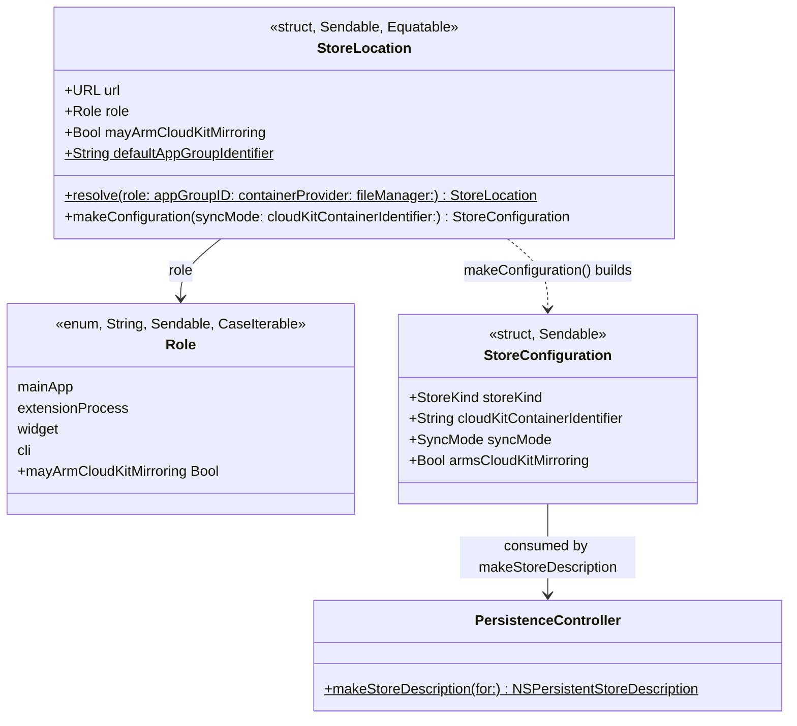
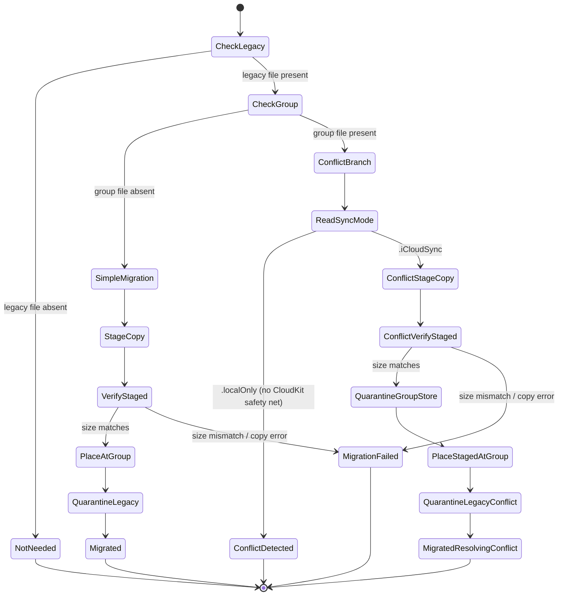

# Plan 1c — Store Location Unification

**Program:** [Data & Sync Hardening](2026-07-28-data-sync-hardening-index.md), Wave 1, plan `1c`.
**Findings:** `X1`, `X2`, `X15` (stories `LIL-15`, `LIL-16`, `LIL-64`), plus the iOS silent
`defaultOnDisk` fallback detail folded into `LIL-15`'s body (no separate finding ID).
**Source review:** [`docs/reviews/2026-07-28-data-sync-review.md`](../../reviews/2026-07-28-data-sync-review.md).

## Why one plan for three findings

All three share one root cause: six processes (iOS app, macOS app, iOS+macOS widgets, the
`lillist` CLI, the Share and Shortcuts extensions) each independently decide "where is the
store on disk" and "should I mirror to CloudKit," and nothing pins those decisions together.
`X1`/`X2` are the same defect shape at different call sites (macOS app, CLI); `X15` is the
mirroring half of the same missing authority. A single canonical resolver is the class-killer
for all three, per the ledger's *Class-killer verdicts* table.

## The defect

- **`X1` — macOS never joined the App Group.** `Apps/Lillist-macOS/Sources/AppEnvironment.swift`'s
  `make()` builds its store from `StoreConfiguration.defaultOnDisk` (the sandbox Application
  Support container) unconditionally. iOS, the widget, and both extensions all resolve
  `group.app.lillist`'s shared container instead. Failure scenario: the macOS widget resolves
  the App Group path, finds nothing, and opens/creates a **second, empty** `Lillist.sqlite`;
  in iCloudSync mode it arms its own mirroring delegate and imports the **entire account** into
  that throwaway file.
- **iOS's own silent fallback (folded into `LIL-15`).** iOS's `make()` does the right thing
  *most* of the time (`StoreConfiguration.appGroupOnDisk`), but silently falls back to
  `defaultOnDisk` when the group container is unreachable (`AppEnvironment.swift:431` as of
  this plan's start) — a fourth, undocumented store-location fork with no error surfaced.
- **`X2` — the CLI opens a third path.** `CLIBridge.StoreLocator.openAppGroup` builds
  `<group>/Library/Application Support/Lillist/Lillist.sqlite`, while `appGroupOnDisk` (iOS,
  widget, extensions) builds `<group>/Lillist/Lillist.sqlite`. The CLI therefore either always
  throws "store not found," or — if a stale file happens to exist at its path from some other
  process — silently operates on a divergent, out-of-sync copy.
- **`X15` — everyone arms CloudKit mirroring.** `PersistenceController.makeStoreDescription`
  attaches `cloudKitContainerOptions` whenever `configuration.syncMode == .iCloudSync`,
  regardless of which process is opening the store. The widget, Share extension, Shortcuts
  extension, and CLI all currently arm their own `NSPersistentCloudKitContainer` mirroring
  delegate against the one shared file. The widget process in particular runs under a ~30MB
  memory budget the engineering notes already flag as unaffordable for a live mirroring
  container.

## Type-system proposal

### `StoreLocation` — the canonical path + mirroring-role resolver



`StoreLocation` is the **single authority** for two questions every one of the six processes
needs answered identically:

1. *Where is the shared store file?* — always
   `<App Group container>/Lillist/Lillist.sqlite`, matching today's already-correct iOS/widget/
   extension behavior. `resolve(role:appGroupID:containerProvider:fileManager:)` throws
   `LillistError.storeUnavailable` when the App Group container is unreachable — **never**
   silently forks to a different path (closes both the iOS fallback detail and the general
   "never silently fork" requirement).
2. *May this process arm CloudKit mirroring?* — `Role.mayArmCloudKitMirroring` answers it
   deterministically; `makeConfiguration(syncMode:)` builds a `StoreConfiguration` with
   `armsCloudKitMirroring` set accordingly.

`containerProvider: (String) -> URL?` (default: the real
`FileManager.containerURL(forSecurityApplicationGroupIdentifier:)`) is the seam the Keystone
harness (below) needs: that real API requires App Group entitlements no unsigned `swift test`
process has, and on this dev machine it turns out to return a *non-nil, auto-created* directory
for **any** group identifier when running unsandboxed (confirmed by the existing
`GatedPersistenceResolverTests`/`StoreLocatorTests`, which already pass today using made-up
group IDs against the real API) — meaning the "container unreachable" branch is untestable
through the real API at all. Tests inject `containerProvider: { _ in tempDirectoryURL }` to
exercise both branches deterministically.

### Role table

| Role | Processes | Path | `mayArmCloudKitMirroring` |
|---|---|---|---|
| `.mainApp` | iOS app, macOS app | `<group>/Lillist/Lillist.sqlite` | **true** |
| `.extensionProcess` | Share Extension, Shortcuts (App Intents) Extension | same | false |
| `.widget` | iOS widget, macOS widget | same | false |
| `.cli` | `lillist` CLI | same | false |

Every role resolves to the **identical file URL** — that's the entire point (`X1`/`X2`'s
class-kill). Only `.mainApp` may attach `cloudKitContainerOptions` (`X15`'s class-kill).
Persistent-history tracking and remote-change-notification posting stay unconditionally on for
every role (unchanged in `PersistenceController.makeStoreDescription`) — only the CloudKit
options attachment is gated.

`.extensionProcess` and `.widget` currently have *identical* `mayArmCloudKitMirroring` values,
but are kept as distinct cases rather than collapsed into one "non-main" role: the codebase
already distinguishes them at the transaction-author level
(`PersistenceController.shareExtensionTransactionAuthor` /
`.appIntentsTransactionAuthor` / `.widgetTransactionAuthor`) for diagnostics, and Wave 5b
(`widget-snapshot-correctness`, `X5`/`X6`) is explicitly scoped to widget-only behavior that may
need to diverge from the Share/Shortcuts extensions later. Matches the wave brief's specified
four-role shape.

### `StoreConfiguration.armsCloudKitMirroring`

New `Bool` field, **default `true`** (preserves every existing call site and test unchanged).
`PersistenceController.makeStoreDescription` gates `cloudKitContainerOptions` attachment on
`canAttachCloudKitOptions && configuration.syncMode == .iCloudSync &&
configuration.armsCloudKitMirroring` — was `canAttachCloudKitOptions &&
configuration.syncMode == .iCloudSync`. Purely additive: no prior test exercises a
`false` value because the field didn't exist.

### `GatedPersistenceResolver` / `MigrationGate` gain an explicit `role`

Both `Extensions/ShortcutsActions/IntentSupport.swift` and
`Extensions/LillistWidget/WidgetIntentSupport.swift` resolve their store through
`GatedPersistenceResolver`, which in turn calls `MigrationGate.resolveStoreConfiguration
(appGroupID:)` → today, `StoreConfiguration.appGroupOnDisk(groupID:syncMode:)`. Neither type
currently has any notion of *which* process is calling it, so both get a required `role:
StoreLocation.Role` parameter threaded through to `StoreLocation.resolve`/`makeConfiguration`.
`ShareRootView.swift` (Share Extension) passes `.extensionProcess`; `IntentSupport.swift`
(Shortcuts) passes `.extensionProcess`; `WidgetIntentSupport.swift` passes `.widget`.

`StoreConfiguration.appGroupOnDisk` is **retired** once nothing calls it — same "don't leave an
attractive nuisance for a future contributor to reach for" precedent Wave 1b applied to
`CascadeReaper.batchDelete`.

## macOS one-time migration — state machine

Runs inside macOS `AppEnvironment.make()`, **before** any `PersistenceController` is
constructed — a pure file-system operation on two closed stores (neither has ever been opened
by this launch yet, so there is no live `NSPersistentStoreCoordinator` to race).



`MacAppGroupMigration.Outcome`:

| Case | Meaning | Which store boots this launch |
|---|---|---|
| `.notNeeded` | No legacy file (fresh install, or already migrated on a prior launch) | App Group |
| `.migrated(quarantinedLegacyAt:)` | Legacy copied into the App Group location; legacy quarantined (moved, never deleted) | App Group |
| `.migratedResolvingConflict(quarantinedAppGroupAt:legacy:appGroup:)` | Both stores existed; see policy below | App Group |
| `.conflictDetected(legacy:appGroup:)` | Both stores existed, `.localOnly` mode — no mutation | Legacy (unchanged, exactly today's behavior) |
| `.migrationFailed(reason:)` | Copy/verify failed (disk space, I/O) — no live store was touched | Legacy (unchanged; retried next launch) |

Every "copy" step goes through `QuarantineManager.copyStore(at:)` (already-tested disk-space
preflight + `.sqlite`/`-wal`/`-shm` copy) to a **staging** location before either live store is
touched, and "verify" compares the staged copy's byte size against the source. Only after a
verified stage does the migration touch either original file — so a failure at any point before
`QuarantineGroupStore`/`QuarantineLegacy` leaves **both** original stores completely untouched,
safely retryable on the next launch. Placement at the App Group location and quarantining the
losing store(s) both go through `QuarantineManager` (`quarantineStore(at:)` moves, never
deletes) — reusing tested primitives rather than hand-rolling new file-transaction code.

### Both-stores-populated policy — council decision

**Council-vote question:** what should the migration do when both the legacy and App-Group
stores already contain data? (This is reachable: if this Mac's widget ever ran under the `X1`
bug, it may have already pulled a full CloudKit replica into the App-Group location.)

**Decision (unanimous ranked-choice, round 2): branch on the persisted `SyncMode`.**

- **`.iCloudSync`** — quarantine the pre-existing App-Group store, then run the same
  stage→verify→place→quarantine-legacy sequence as the simple case, landing on
  `.migratedResolvingConflict`. Justification: in this mode CloudKit's own mirroring *is* the
  convergence mechanism the review's premise assumed — any content unique to the losing store
  that was ever successfully exported re-flows in on next sync, and completing the unification
  (rather than leaving the affected population stuck in the exact dual-store state `X1`
  describes, forever) is worth the narrow, bounded risk of losing a widget edit that hadn't yet
  round-tripped through CloudKit at the moment of migration.
- **`.localOnly`** — make **no** file mutation; return `.conflictDetected` carrying both stores'
  forensic metadata (size + mtime for each `.sqlite`/`-wal`/`-shm`) for later diagnosis; keep
  booting on the **legacy** store exactly as today. Justification, confirmed by reading
  `Extensions/LillistWidget/WidgetIntentSupport.swift` →
  `GatedPersistenceResolver`/`MigrationGate` → `StoreConfiguration.appGroupOnDisk`: in
  `.localOnly` mode the App-Group store has **no CloudKit mirror at all**
  (`cloudKitContainerOptions` is never attached). A task completed via the widget in this mode
  exists in exactly one place on disk — quarantining that store would be unconditional,
  permanent, unrecoverable loss of a real user action, not a bounded risk. The council's
  round-1 split (defer-indefinitely vs. quarantine-and-migrate) was resolved by this
  mode-dependent distinction: an unconditional default is wrong in `.localOnly` specifically
  because there is no safety net there, and wrong to apply *indefinitely* in `.iCloudSync`
  specifically because there **is** one. Full audit trail:
  `.council/macos-migration-both-stores-populated/DECISION.md`.

**Binding implementation requirements carried from deliberation** (see `DECISION.md`'s closing
section for full detail):

1. The `SyncMode` read must happen strictly before any candidate store's files are touched.
2. Both conflict outcomes carry forensic metadata (`StoreFootprint`: size + mtime for
   `.sqlite`/`-wal`/`-shm`) so a log/crash-report surface is actionable, not a bare enum case.
3. **Quarantine folder-naming collision, found during deliberation:**
   `QuarantineManager.quarantineStore(at:)`/`copyStore(at:)` derive their destination folder
   from `Int(clock().timeIntervalSince1970)` (1-second granularity) and both `moveItem`/
   `copyItem` throw on an existing destination. The `.iCloudSync` conflict branch calls these
   methods up to three times within one fast, synchronous run — a same-second collision is
   realistic, not theoretical. Fix: add an optional `label: String?` parameter to both methods
   (nil preserves today's folder name exactly, so every existing `QuarantineManager` test is
   unaffected); this migration's three call sites pass distinct labels
   (`"macos-migration-staging"`, `"macos-migration-app-group-conflict"`,
   `"macos-migration-legacy"`). This is a small, targeted, backward-compatible addition — **not**
   an adoption of `S18`'s broader Wave-3b folder-collision scope, which covers other call sites
   this plan does not touch.
4. **Discoverability, not log-only:** the resolved `MacAppGroupMigration.Outcome` is retained on
   `AppEnvironment` (a new `let macAppGroupMigrationOutcome: MacAppGroupMigration.Outcome`) and
   logged through `breadcrumbs` during `bootstrap()` once that buffer exists, so it's visible in
   crash reports even though no new UI ships in this plan (YAGNI — building a dedicated
   conflict-resolution screen for a one-time bug-fix migration is out of scope). The ledger's
   manual-verification checklist (below) is updated to explicitly call out reproducing the
   dual-populated-store scenario, not just a generic "migration with data intact" check.

`.migrationFailed` is a **returned outcome**, not a thrown error — disk-space/I/O failure during
a copy is an expected, recoverable condition (matching `QuarantineManager`'s own
`insufficientDiskSpace` fail-closed precedent) that should degrade macOS back to today's
legacy-store behavior for this launch, not block app startup entirely. Only a genuinely
exceptional condition (e.g. can't read file attributes at all) throws.

## Keystone: multi-process test harness

Two deliverables, both pure-`LillistCore`, no live App Group entitlement needed:

1. **Multi-process store harness** — open **two** `PersistenceController`s against **one**
   on-disk store file in a temp directory (SQLite WAL mode supports concurrent connections
   in-process; this simulates the real cross-process topology closely enough to prove the
   write-visibility contract). Write via controller A, confirm controller B observes it after a
   context refresh — the thing no existing test exercises (per the review's "Structural test
   gaps" note: "no test opens two `PersistenceController`s against one store file").
2. **Path-pin regression test** — call `StoreLocation.resolve(role:containerProvider:)` for all
   four roles against the same injected temp-directory container, assert all four `.url` values
   are exactly equal. This is the direct regression proof for `X1`/`X2`: the whole defect class
   was "roles disagree about the path."

Lives in `Packages/LillistCore/Tests/LillistCoreTests/Persistence/` (harness) and
`Packages/LillistCore/Tests/LillistCoreTests/Sync/` or `Persistence/` (path-pin), reusable
as-is by Wave 5b (`widget-snapshot-correctness`) and any future cross-process test.

## Widget cache-miss note (out of scope, flagged forward)

`X5`/`X6` (widget cache-miss treating an empty filter list as success, pruning real snapshots)
are **not** touched here — owned by plan `5b`. This plan's role-wiring for `.widget` is
mechanical (route through `StoreLocation`/`GatedPersistenceResolver` with an explicit role,
suppress mirroring); it does not change the widget's cache-rebuild logic at all. `5b`'s harness
work can build directly on this plan's Keystone multi-process harness.

## Commit plan (two-hats, TDD red→green per commit)

1. `docs(plans): plan 1c store-location-unification — resolver + migration design` (this file).
2. `feat(core): add StoreLocation, the canonical store-path resolver (X2)` — new type + role
   enum + tests; wire `CLIBridge.StoreLocator.openAppGroup` to it, retiring its ad-hoc third
   path. Closes `LIL-16`.
3. `feat(core): suppress CloudKit mirroring for extension/widget/CLI roles (X15)` —
   `StoreConfiguration.armsCloudKitMirroring`, `PersistenceController.makeStoreDescription`
   gating, `role` parameter on `GatedPersistenceResolver`/`MigrationGate`, wire Share/Shortcuts/
   Widget/CLI call sites. Closes `LIL-64`.
4. `fix(ios): resolve the app-group store through StoreLocation, removing the silent
   defaultOnDisk fallback` — small, behavior-only change; part of `LIL-15`'s folded-in scope,
   no `Closes` yet (macOS's half isn't done).
5. `feat(core,macos): one-time macOS App-Group store migration (X1)` —
   `MacAppGroupMigration` + `QuarantineManager` label parameter + macOS `AppEnvironment.make()`
   wiring. Closes `LIL-15`.
6. `test(core): multi-process store harness + path-pin regression test` — the Keystone
   deliverable, run once every role/call site from steps 2-5 exists to pin against.

## Verification gate

```bash
export DEVELOPER_DIR=/Applications/Xcode-beta.app/Contents/Developer
swift test --package-path Packages/LillistCore --parallel --num-workers 2   # baseline 1144/219 — must not regress
swift build --package-path Packages/LillistCLI
```

Plus unsigned `xcodebuild` builds for both `Lillist-iOS` and `Lillist-macOS` (both apps'
`AppEnvironment.swift` are touched).

## Ledger updates this plan makes

- Manual-verification checklist: split the existing "macOS pre/post store-location migration
  with data intact" line into (a) the simple single-store case and (b) the dual-populated-store
  conflict case, so Mikey's manual pass explicitly covers the scenario the council vote reasoned
  about.
