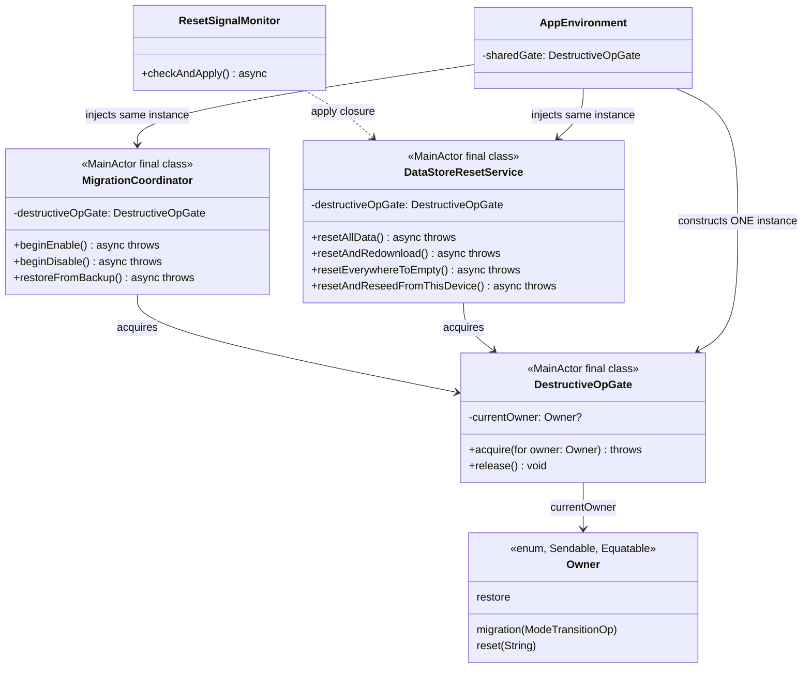
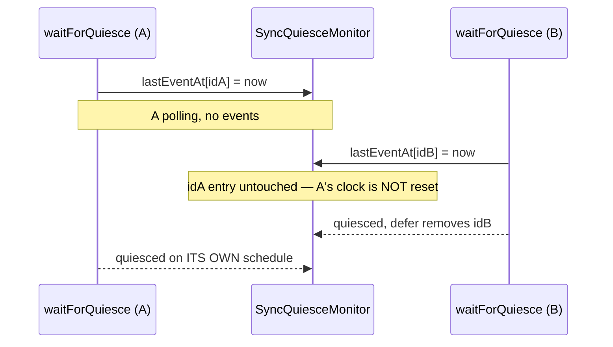

# Plan 2a — Migration Transitions

> Wave 2, plan `2a` of the [Data & Sync Hardening program](2026-07-28-data-sync-hardening-index.md).
> Findings: `S1 S5 S6 S8 S11 S12 S14 S15 S16 S17` (stories `LIL-11 LIL-26 LIL-27
> LIL-29 LIL-34 LIL-35 LIL-52 LIL-53 LIL-54 LIL-55`). Hotspots:
> `Sync/MigrationCoordinator.swift`, `Persistence/PersistenceHost.swift`,
> `Sync/DataStoreResetService.swift`, `Sync/SyncQuiesceMonitor.swift`,
> `Sync/MigrationGate.swift`, `Sync/MigrationJournal.swift`,
> `Sync/ResetSignalMonitor.swift`, both apps' `LillistApp.swift`.
>
> Per the ledger's *shared-file serial chains* #2/#3, this is the **first**
> plan to touch `MigrationCoordinator.swift`/`PersistenceHost.swift` — `2b`
> (backup/restore) and `3a` (account identity) follow.

## 1. Why this plan exists

The migration state machine promises four transitions (`replaceICloudWithLocal`,
`replaceLocalWithICloud`, `syncFirstThenDisable`, `disableNow`) with a
crash-recoverable journal. The 2026-07-28 review found the machine dishonest
in five distinct ways, plus three smaller correctness gaps:

1. **`S1`** — `replaceLocalWithICloud` never wipes local data; it just
   attaches mirroring, so local rows *merge* into iCloud instead of being
   replaced. `MigrationPhase.removingLocalStore` exists but nothing ever
   emits it.
2. **`S6`** — `replaceICloudWithLocal` erases the iCloud zone *after*
   mirroring re-attaches, so remote data can merge back in before the erase,
   and CloudKit's own export bookkeeping may already believe the
   about-to-be-erased rows were uploaded.
3. **`S8`** — `SyncModeStore` advances the instant `reconfigure` returns,
   before quarantine/erase/quiesce even run, and is never reverted on
   failure.
4. **`S11`** — migration and data-store reset have separate, type-local
   reentrancy guards; nothing stops them running concurrently against the
   same `PersistenceHost`.
5. **`S12`** — a failed `rebuildEmptyStore` leaves the coordinator
   store-less with no reattach handler, and `flushAndSwap` can silently
   "succeed" with zero attached stores.
6. **`S14`** — `waitForQuiesce`'s result is discarded, `.setup` events don't
   count as activity, and the single shared monitor lets concurrent waiters
   stomp on each other's clocks.
7. **`S15`** — a corrupt/unparseable journal reads as `.idle` (fail-open) in
   both `MigrationGate` and the coordinator's own reentrancy guard.
8. **`S16`** — the recovery sheet only appears for *stale* (>600s) journals;
   a fresh crash leaves the user staring at a blocked app with no
   explanation.
9. **`S17`** — the iCloud-unavailable launch screen swaps mode with reversed
   step ordering, no journal, no gate, bypassing the coordinator entirely.

`S5` is listed as its own finding but is a symptom of the same
"quiesce isn't honored" root cause as `S14` — its fix is the specific
`syncFirstThenDisable` call site now correctly waiting *before* detaching.

**Scope boundary (binding, from the wave brief):** `S2`/`S4`/`S7`
(`restoreFromBackup` ordering, live-package restore, quarantine-copy timing)
live in the same files but belong to `2b`. Where this plan's reordering
touches code `2b` will also touch, the seam is called out explicitly below.

## 2. `DestructiveOpGate` — type proposal

### Problem

`MigrationCoordinator.isMigrating` and `DataStoreResetService.isResetting`
are independent `@MainActor` booleans. Each closes its *own* type's
reentrancy window (a second `beginEnable` while one is running), but nothing
stops a migration and a reset running concurrently — both mutate the same
`PersistenceHost` (`tearDownStore`/`rebuildEmptyStore`/`reconfigure` are not
mutually exclusive across types). `ResetSignalMonitor`'s automatic peer-reset
application (`checkAndApply` → `DataStoreResetService.resetAndRedownload()`)
makes this reachable without any user action: a peer's reset broadcast can
arrive and auto-apply at the exact moment the user is running a Settings
migration.

### Design



**Why `@MainActor final class`, not an `actor`.** Every caller
(`MigrationCoordinator`, `DataStoreResetService`) is already `@MainActor`.
Both types' existing single-flag guards are deliberately *synchronous* —
set *before* the first `await` — to close a same-process reentrancy window:
two `begin*` calls enqueued back-to-back on the MainActor both pass a
persisted-journal check (which reads a file), then the first one to run
sets its flag before suspending again, so the second sees it set at its own
first synchronous check. An `actor`'s `acquire()` would have to be `async`,
reopening exactly that window (the two `begin*` calls could both reach the
`await acquire()` before either finishes acquiring). Since every caller is
already MainActor-bound, a plain `@MainActor` class gives the same
synchronous-check guarantee as the flags it replaces, for free.

**Why replace the flags instead of layering a gate on top of them.** Two
overlapping reentrancy mechanisms (a type-local flag *and* a shared gate)
would be redundant and a future maintainer would not know which one is
authoritative. `DestructiveOpGate` becomes the *only* reentrancy mechanism
for both types; `isMigrating`/`isResetting` are deleted.

**Why `Owner` carries a description.** The old error messages
(`"A sync-mode migration is already in progress."` / `"A data-store reset is
already in progress."`) only ever named the *requester's own* operation type.
With one shared gate, the message can now name what's actually *holding* the
gate too — e.g. `"Can't start a sync-mode migration (disableNow): a data-store
reset (resetAndRedownload) is already in progress."` — genuinely more
diagnosable when a peer's auto-applied reset blocks a user-initiated
migration.

**`ResetSignalMonitor` needs no code change.** `checkAndApply()`'s existing
catch block already leaves a failed-to-apply event pending (not acknowledged,
not marked applied) for the next tick/relaunch to retry — see its doc
comment on apply/acknowledge ordering. Once `DataStoreResetService.resetAndRedownload()`
throws because the gate is held by a migration, that throw flows into
`checkAndApply()`'s existing retry-later path unchanged. This is verified by
a new test (`ResetSignalMonitorGateTests`), not by touching
`ResetSignalMonitor.swift`.

**`restoreFromBackup` also acquires the gate.** It mutates files and calls
`host.reconfigure` — a third destructive operation shape (`Owner.restore`)
that should not interleave with a fresh migration or a reset either.

### `Owner` API

```swift
@MainActor
public final class DestructiveOpGate {
    public enum Owner: Sendable, Equatable, CustomStringConvertible {
        case migration(ModeTransitionOp)
        case reset(String)   // e.g. "resetAllData", "resetAndRedownload"
        case restore

        public var description: String { /* human-readable, used in error messages */ }
    }

    public private(set) var currentOwner: Owner?
    public init() {}

    /// Claim the gate for `owner`. Throws `storeUnavailable` naming both
    /// the requested and the blocking operation if already held.
    public func acquire(for owner: Owner) throws

    /// Release unconditionally. Every caller pairs this with `acquire`
    /// via `defer`, so there is never a legitimate "wrong owner" release.
    public func release()
}
```

Defaults to a **fresh private instance** per `MigrationCoordinator`/
`DataStoreResetService` (`destructiveOpGate: DestructiveOpGate = DestructiveOpGate()`)
so every existing unit test that builds one type in isolation is unaffected.
`AppEnvironment` is the only place that constructs *one* instance and passes
it to both, closing the cross-type window in production.

## 3. Target state machine

Every op now follows the same four-block shape: **preamble** (reentrancy +
notifications) → **recovery-anchor + destructive work** (op-specific order —
this is where `S1`/`S6` differ) → **quiesce** (op-specific position and
timeout handling — `S5`/`S14`) → **finalize** (`S8`'s deferred mode advance).

### 3.1 Preamble (all four ops, unchanged in shape, hardened per `S11`/`S15`)

1. Read the journal. **Decode failure → throw immediately** (`S15`; see
   §5). Missing file → `.idle`, unaffected. In-flight → throw
   `"already in progress"`.
2. `destructiveOpGate.acquire(for: .migration(op))` — throws if a reset or
   another migration holds it (`S11`). Both steps are synchronous, before
   any `await`.
3. Emit `.preparing`; cancel all pending notifications.
4. Write journal: `state: .preparing, operation: op, startedAt: now,
   lastHeartbeatAt: now, previousMode: host.currentMode`.

### 3.2 Per-op destructive sequence

| Step | `replaceLocalWithICloud` (`S1`) | `replaceICloudWithLocal` (`S6`) | `syncFirstThenDisable` (`S5`) | `disableNow` |
|---|---|---|---|---|
| 1 | precondition: none | **precondition: `localStoreRowCount() > 0`** else `.localDataEmpty` | none | none |
| 2 | — | account-changed pre-flight (moved up, still immediately before erase) | — | — |
| 3 | `.quarantining` → `emit(.backingUp)` → **`host.tearDownStore(backupVia:)`** (closes the connection, copies the *pre-wipe* local store) → record `quarantineFolderName` | `.quarantining` → `emit(.backingUp)` → `quarantine.copyStore(at: storeURL)` on the still-open store (mechanism **unchanged** — this is `S7`'s territory, left alone) → record folder | **`.awaitingSync` → `emit(.uploading(nil))` → `waitForQuiesce` FIRST** (pre-destructive: `.timedOut` **throws** — see §4) | `.quarantining` → `emit(.backingUp)` → `copyStore` if present |
| 4 | `emit(.removingLocalStore)` → **`host.rebuildEmptyStore()`** (destroy + fresh empty store, still `.localOnly`) — on throw: best-effort `host.reattachStore()` (`S12`) | `.mutatingCloudKit` → `emit(.erasingICloud(0))` → **`zoneEraser.eraseManagedZones`** — **moved before reconfigure** | `.quarantining` → `emit(.backingUp)` → `copyStore` if present | `.reconfiguringStore` → `emit(.reconfiguringStore)` → `host.reconfigure(to: .localOnly)` |
| 5 | `emit(.reconfiguringStore)` → `host.reconfigure(to: .iCloudSync)` (now against the **fresh empty store**) | `.reconfiguringStore` → `emit(.reconfiguringStore)` → `host.reconfigure(to: .iCloudSync)` (now against the **untouched, still-populated** store, freshly erased zone) | `.reconfiguringStore` → `emit(.reconfiguringStore)` → `host.reconfigure(to: .localOnly)` | — |
| 6 | `.awaitingSync` → `emit(.downloading(nil))` → `waitForQuiesce` (post-destructive: `.timedOut` **logs, does not throw**) | `.awaitingSync` → `emit(.uploading(nil))` → `waitForQuiesce` (post-destructive: logs, does not throw) | — (already waited in step 1) | — |
| 7 | `.finalizing`: **`syncModeStore.setMode(.iCloudSync)`** (`S8` — only here) → `restoreSteadyState` → `journal.clear()` → `emit(.completed)` | same, `setMode(.iCloudSync)` | `.finalizing`: `setMode(.localOnly)` → `restoreSteadyState` → `journal.clear()` → `emit(.completed)` | same, `setMode(.localOnly)` |

**Why `replaceICloudWithLocal`'s reorder doesn't need a teardown.** The
"erase while torn down" idiom `DataStoreResetService` uses exists because a
reset can run against a store that is *already* `.iCloudSync` (live
mirroring delegate racing the erase). `replaceICloudWithLocal` only ever
runs from `.localOnly` (enforced by `beginEnable`'s call shape — direction
only matters for the `.iCloudSync` target). At the moment the erase runs,
there is no mirroring delegate attached at all — reconfigure hasn't
happened yet — so there is nothing to race. Moving the erase earlier and
leaving the store attached is sufficient and keeps `PersistenceHost`'s
single-attached-store constraint trivially satisfied (never more than one
store attached, never a moment with zero either). **No council vote
needed** — the brief's "council if two defensible orderings exist" clause
doesn't apply because the reordering follows directly from the state
transition's own precondition (always starts `.localOnly`), not a genuine
tradeoff.

**Why `replaceLocalWithICloud` doesn't get a new persisted journal state
for the teardown/rebuild sub-steps.** Considered adding
`MigrationJournal.State.removingLocalStore` to mirror the UI-facing
`MigrationPhase` case. Rejected directly (no council needed): whichever of
`tearDownStore`/`rebuildEmptyStore`/`reconfigure` a crash lands in, the two
recovery actions available (`restoreFromBackup` / "Try Again") behave
identically regardless of which sub-step died — `restoreFromBackup` always
restores the quarantined pre-wipe backup and reverts mode; "Try Again"
always just clears the journal and lets the user re-trigger the op from
Settings. Finer persisted-state granularity would add surface area with no
corresponding behavior difference for either recovery path to key off — a
straightforward YAGNI call, not a coin flip. `MigrationPhase.removingLocalStore`
(the *UI*-facing enum) is still emitted for progress-sheet fidelity; only
the journal's persisted `State` reuses `.reconfiguringStore` for the whole
tearDown→rebuild→reconfigure trio.

**`S12` reattach coverage.** `rebuildEmptyStore` is now called from two
places: `DataStoreResetService.performReset` (existing, but with no
reattach on failure today) and the new `replaceLocalWithICloud` path above.
Both now wrap the call so a failure triggers a best-effort
`host.reattachStore()` before the failure propagates — mirroring the
zone-erase failure path's existing "never leave the coordinator store-less"
handling. `reattachStore()` is itself a safe no-op when a store is already
attached (`guard coordinator.persistentStores.isEmpty else { return }`), so
calling it defensively even when the exact sub-step that failed is
ambiguous (e.g. `tearDownStore` can itself throw *after* detaching the
store, if the quarantine copy's disk-space pre-flight fails post-detach) is
always safe.

### 3.3 Failure path (all ops)

```
catch {
    if op == .replaceLocalWithICloud { try? await host.reattachStore() }  // S12
    entry.state = .failed
    entry.failureReason = "\(error)"
    journal.write(entry)  // best-effort
    emit(.failed(reason: "\(error)"))
    breadcrumb(..., success: false)
    destructiveOpGate.release()  // via defer, always
    throw error
}
```

Mode is **never** advanced before step 7 above, so on any failure
`syncModeStore.currentMode()` still reads `previousMode` — no explicit
"revert" call is needed in the catch block; there is structurally nothing
to revert (`S8`). `restoreFromBackup`'s existing explicit
`syncModeStore.setMode(prev)` is kept unchanged — it remains the correct
handling for the one window where mode genuinely *could* have already
advanced (a crash between `setMode` and `journal.clear()` inside
`.finalizing`, both of which now sit next to each other at the very end).

### 3.4 Crash-recovery matrix

| Journal state at crash | What actually happened | `syncModeStore` reads | Restore from Backup | Try Again |
|---|---|---|---|---|
| `.preparing` | notifications cancelled only | `previousMode` | restores quarantine (none yet — falls back to latest or throws `storeUnavailable`) | clears journal, no-op otherwise — correct, nothing was touched |
| `.quarantining` | recovery anchor may or may not be fully copied | `previousMode` | restores the (possibly-absent) anchor; the `S18`-scope disk-space pre-flight (out of scope here) still guards the copy itself | clears journal — correct, destructive work hasn't started |
| `.mutatingCloudKit` (enable/replaceICloud only) | zone erase may be partially done — **irreversible** | `previousMode` | restores local file (unaffected by the erase); mode reverts to `previousMode` (`.localOnly`) — user keeps their local copy | clears journal; user may re-run — the previously-erased zone is fine to erase again (idempotent) |
| `.reconfiguringStore` | store swap (and, for `replaceLocalWithICloud`, teardown+rebuild) may be partial | `previousMode` | restores quarantined anchor; **for `replaceLocalWithICloud`, this is the ONLY way to recover pre-wipe local data** | clears journal; coordinator's own `reattachStore` safety net (see §3.2) already left a usable (if empty, for the wipe path) store |
| `.awaitingSync` | structural work done; only the quiesce wait was interrupted | `previousMode` (mode advances only in `.finalizing`) | restores anchor, reverts mode — always valid, if heavy-handed for a case where only the wait was interrupted | clears journal; data is already structurally correct, so this is actually the *better* choice here, but the UI doesn't currently distinguish — noted as a `2b`/UX-polish opportunity, not required by any of the 10 findings |
| `.finalizing` | mode may already be the target; only notification-restore/journal-clear was interrupted | `previousMode` **or** target (crash window between `setMode` and `journal.clear()`) | restores anchor, reverts mode — safe either way | clears journal — leaves whichever mode `setMode` reached; correct since the structural work is done |
| `.failed` | terminal — already recorded | `previousMode` | as above | as above |

## 4. Quiesce semantics (`S14`, feeds `S5`)

### 4.1 `.setup` events must count as activity

`SyncQuiesceMonitor`'s watcher currently bumps `lastEventAt` only for
`.import`/`.export`. A freshly-attached mirror's `.setup` handshake can run
for several seconds with zero `.import`/`.export` traffic; today's monitor
can declare `.quiesced` while `.setup` is still in progress. Fix: every
event type bumps the clock — `CloudKitSyncEvent.EventType` is exhaustively
`{setup, import, export}`, so the type filter is simply removed.

### 4.2 Per-waiter isolation

The actor's single `private var lastEventAt: Date` is shared across every
call to `waitForQuiesce`. Two concurrent waiters (even against the same
monitor instance) stomp on each other: waiter B's mere *entry* into the
function (`lastEventAt = Date()`) resets waiter A's clock, even with zero
real CloudKit events — A's "quiet window" is pushed back by B simply
starting. Fix: replace the single `Date` with `[UUID: Date]`, one entry per
in-flight `waitForQuiesce` call, cleaned up via `defer` on exit. Each
waiter's poll loop only ever reads its own dictionary entry.



Even after `S11`'s gate makes migration/reset mutually exclusive in
production, this fix stands on its own merits (a shared-mutable-clock
design is fragile regardless of whether today's call graph happens to avoid
triggering it) and is independently tested.

### 4.3 Honoring `.timedOut` — asymmetric by design, not a bug

| Caller | Position relative to destructive work | `.timedOut` behavior | Why |
|---|---|---|---|
| `syncFirstThenDisable` | **before** `reconfigure` (moved here by `S5`) | **throws** `syncFailure`, migration fails, mode never advances | The whole point of "sync first" is to guarantee the final export landed before disconnecting. A timeout here means it may not have — proceeding would silently strand edits, the exact bug `S5` reports. Nothing irreversible has happened yet, so failing closed is free. |
| `replaceLocalWithICloud` download wait | after `reconfigure` | **logs + breadcrumb, proceeds to `.completed`** | The wipe+reconfigure already succeeded; reverting is impossible (local data is already gone) and pointless (iCloud will keep downloading in the background regardless of whether this coordinator call is still waiting). |
| `replaceICloudWithLocal` upload wait | after `reconfigure` (which now follows the erase) | same — logs, proceeds | The erase already happened (irreversible); the upload will keep draining via the live mirroring delegate after this call returns. |
| `DataStoreResetService.performReset` | after `rebuildEmptyStore` | same — logs, proceeds | Matches the enable-op reasoning; `resetAllData`/`resetAndRedownload`/etc. already completed their destructive work by this point. |

This asymmetry is exactly what `QuiesceResult.timedOut`'s own (pre-existing)
doc comment already specifies: *"the caller proceeds anyway and surfaces
'still syncing in background' copy."* The fix is making every caller
actually branch on the result instead of discarding it via `_ = await
...` — not inventing new behavior. **No council vote needed.**

## 5. `S15` — fail-closed journal reads

`FileMigrationJournalStore.read()` already has the right shape: missing
file → `.idle` (no throw), present-but-undecodable → propagates the
`DecodingError` (no catch). The bug is entirely at the two call sites that
swallow *any* throw via `try?`:

- `MigrationGate.evaluate()`: `(try? journal.read()) ?? .idle` — a decode
  failure is indistinguishable from "no journal," so extensions/CLI/widget
  proceed to open the store on top of unreadable state.
- `MigrationCoordinator.runMigration`'s reentrancy check: `if let current =
  try? journal.read(), current.isInFlight` — a decode failure makes the
  `if let` fail, silently *skipping* the reentrancy check entirely and
  starting a brand new migration on top of whatever state produced the
  corruption.

Fix: both sites `do`/`catch` the read explicitly. A decode failure throws/
aborts with a distinct message naming the journal as unreadable, rather
than being conflated with either "idle" or "in-flight."

## 6. `S16` — fresh-crash recovery has no UI affordance

`OnboardingPresentationModifier.evaluate()` (both apps) only presents
`.recovery(journal)` when `journal.isStale()` (>600s). A journal that's
in-flight but *not yet* stale shows nothing — yet `MigrationGate` already
blocks every extension unconditionally on any non-idle journal, so the user
sees a broken Share Extension / Shortcuts action with zero explanation for
up to 600+ seconds.

**Only the main app ever runs `MigrationCoordinator`** — grepped
confirmed zero call sites in `Extensions/`. A non-idle journal found at
*launch* therefore can never belong to a still-running migration in another
live process: the coordinator's own work is entirely synchronous
`await`-chained inside one MainActor call from a single app process, and
that process is, by definition, not the one currently evaluating (a fresh
launch reading a stale-or-fresh non-idle journal is *always* looking at a
previous, now-dead process's leftover state — there is no scenario in this
codebase where a second live process could still be "completing" it). The
existing `isStale()` gate was solving a race that doesn't exist in
production. Fix: drop the gate — present `.recovery(journal)` for **any**
`isInFlight` journal at launch, immediately.

## 7. `S17` — iCloud-unavailable launch screen bypasses the coordinator

Today:

```swift
ICloudUnavailableScreen {
    Task {
        await environment.syncModeStore.setMode(.localOnly)       // reversed —
        try? await environment.persistenceHost.reconfigure(to: .localOnly)  // everywhere
        launch = .onboarding                                       // else it's
    }                                                                // the other
}                                                                     // way around
```

This is semantically a `disableNow` transition (iCloudSync → localOnly,
immediate, no final sync — there's no iCloud account to sync with) that
happens to run before onboarding. It has no journal, no gate, swallows the
reconfigure error via `try?`, and orders `setMode` before `reconfigure`
(exactly backwards from every other call site). Fix: route it through
`environment.migrationCoordinator.beginDisable(strategy: .now, storeURL:)`,
identically to the Settings-driven disable flow. On failure, surface the
freshly-written `.failed` journal via the *same* recovery sheet (`launch =
.recovery(journal)`) rather than silently proceeding to onboarding on an
inconsistent store.

## 8. Test plan (TDD, red→green, finding-referencing names)

Extends `MigrationRunnerExecutingTests`/`MigrationRecoveryTests`/
`MigrationCoordinatorTests`/`MigrationCoordinatorRestoreTests`/
`DataStoreResetServiceTests`/`PersistenceHostTests`/`SyncQuiesceMonitorTests`/
`MigrationGateTests` per the ledger's "extend, don't fork" directive. New
files only for genuinely new types (`DestructiveOpGateTests`) or app-level
seams that don't fit an existing suite.

- `S1`: `replaceLocalWithICloud` tears down → rebuilds empty → reconfigures,
  in that order, against a real in-memory-backed fake proving pre-existing
  local rows do NOT survive (the class-killer: assert row count is 0
  immediately after the op, before any download could have repopulated it).
- `S6`: erase precedes reconfigure for `replaceICloudWithLocal` (phase-order
  assertion via `collectPhases`, mirroring the existing pattern).
- `S8`: for every op and every failure-injection point, `syncModeStore`
  never leaves `previousMode` until `.completed`. **Updates
  `MigrationCoordinatorTests.runMigrationRejectsLowDiskSpace`**, whose
  existing assertions (`host.currentMode == .iCloudSync` after a
  post-reconfigure failure) codify the S8 bug being fixed here — this is a
  finding-driven test change, not a regression.
- `S11`: `DestructiveOpGateTests` (acquire/release/owner-description) +
  cross-type test (`MigrationCoordinator` holds the gate → concurrent
  `DataStoreResetService` call throws, and vice versa) +
  `ResetSignalMonitorGateTests` (apply failure from a held gate leaves the
  event pending/unacknowledged, retried on next tick).
- `S12`: `rebuildEmptyStore` failure → `reattachStore` called, in both
  `DataStoreResetServiceTests` (existing suite, new case) and the new
  `replaceLocalWithICloud` path. `PersistenceHostTests`: `flushAndSwap`
  with zero attached stores throws instead of silently returning.
- `S14`: `.setup` churn now delays quiescence (inverts the existing
  `setupEventsAreIgnored` test — see below); concurrent-waiter isolation
  test; per-call-site timeout-handling tests (throws for
  `syncFirstThenDisable`, logs-and-proceeds for the other three call sites).
- `S15`: `MigrationGateTests` + coordinator reentrancy test, both with a new
  `CorruptMigrationJournalStore` fake (read throws a decode-shaped error) —
  asserts `.abort`/throw, distinct from both `.idle` and `.isInFlight`.
- `S16`/`S17`: app-level — these live in `Apps/*/Sources`, which have no
  existing unit-test target exercising `OnboardingPresentationModifier`
  directly (it's `private` to each `LillistApp.swift` and UI-tested only via
  full XCUITest). Verified by unsigned `xcodebuild build` for both apps
  (compiles, wiring type-checks) plus manual reasoning captured in this doc;
  flagged on the manual-verification checklist for the recovery-sheet
  *appearance* timing, matching how `S16`/`S17`'s sibling UI findings in
  other plans are handled when no host-side unit test target reaches them.

**Inverted test, called out explicitly (two-hats discipline —
`MigrationCoordinatorTests.runMigrationRejectsLowDiskSpace` and
`SyncQuiesceMonitorTests.setupEventsAreIgnored` both currently assert the
*buggy* behavior as correct):** both are updated in the same commit as
their respective fix (not a separate commit), since a test that encodes a
finding's bug as "expected" cannot be left green after the code changes —
there is no way to land the fix and keep the old assertion.

## 9. Council-vote log

**No council votes were needed for this plan.** Every design question that
arose (`S6`'s ordering, the `replaceLocalWithICloud` journal-state
granularity, `S16`'s gate removal, `DestructiveOpGate`'s actor-vs-class
shape) resolved to a single defensible answer once traced against the
existing code's own documented constraints and invariants — see the
reasoning inline in §3–§6 above. Per the wave brief's own criterion
("council if two defensible orderings exist"), none of these presented a
genuine second defensible alternative once analyzed.

## 10. Verification (binding protocol)

```bash
export DEVELOPER_DIR=/Applications/Xcode-beta.app/Contents/Developer
swift test --package-path Packages/LillistCore --parallel --num-workers 2 > /tmp/suite.log 2>&1; echo EXIT:$?
grep -E "Test Suite .* failed|Note: Some test targets reported failures" /tmp/suite.log
```

Run twice (this plan touches shared fixture-adjacent state — the
`DestructiveOpGate` default-instance-per-type pattern and `SyncModeStore`
suite names — matching the `LIL-79` precedent's risk profile). Baseline to
beat: `1195` tests / `225` suites + `89` `XCTestCase` methods (Wave 1d's
closing figure). Unsigned `xcodebuild build` for both `Lillist-iOS` and
`Lillist-macOS` schemes (this plan touches `Apps/*/Sources`).
