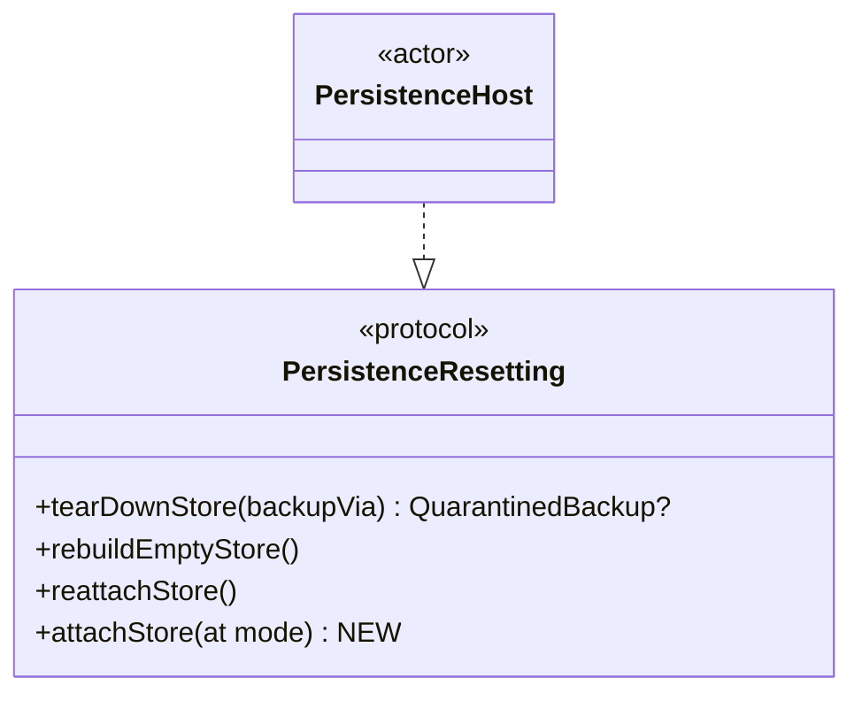
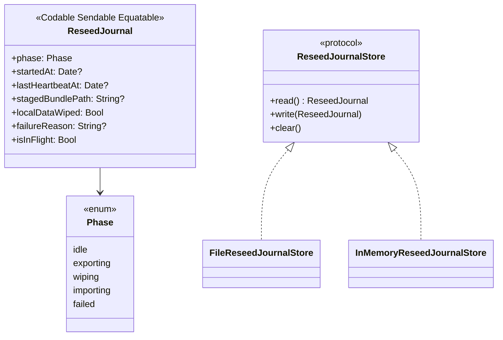

# Plan 2b — Backup/Restore Correctness

> Wave 2, plan `2b` of the [Data & Sync Hardening program](2026-07-28-data-sync-hardening-index.md).
> Findings: `S2 S4 S7 S9b S23` (stories `LIL-12 LIL-14 LIL-28 LIL-31 LIL-61`).
> Hotspots: `Sync/MigrationCoordinator.swift`, `Persistence/PersistenceHost.swift`,
> `Persistence/PersistenceResetting.swift`, `Persistence/QuarantineManager.swift`,
> `Sync/DataStoreResetService.swift`, `Backup/BackupRestoreService.swift`,
> `Backup/LocalBackupCoordinator.swift`, `Backup/BackupSnapshotManager.swift`,
> `Backup/TaskBackupStore.swift`.
>
> Per the ledger's *shared-file serial chains* #2/#3, `2a` ✅ done is the
> first link touching `MigrationCoordinator.swift`/`PersistenceHost.swift`;
> this plan is the second. `3a` follows.

## 0. Two "backup/restore" subsystems — do not conflate

This codebase has two entirely separate things both called "restore":

1. **`MigrationCoordinator.restoreFromBackup`** — crash recovery for a
   *sync-mode migration*. Restores a raw SQLite file from
   `QuarantineManager`'s quarantine folder. `S2`/`S7` live here.
2. **`BackupRestoreService.restore(from:)`** — the user-facing "Restore
   from Backup" feature. Restores from the JSON `TaskBackupStore`
   package (or a `.zip` snapshot) via `Importer`. `S4`/`S23` live here.
   `S9b` (`DataStoreResetService.resetAndReseedFromThisDevice`) is a
   third, related destructive flow (export → wipe → reimport) that
   shares `performReset` with `BackupRestoreService`'s wipe half.

No code changes in this plan connect these two subsystems. `S23`'s
"wire the post-reset rebuild" applies only to the JSON-package
subsystem (`DataStoreResetService`/`BackupRestoreService`); the raw-file
subsystem's equivalent gap (a crash-recovery restore doesn't fire an
explicit backup-package reconcile either) is a real but out-of-scope
residual — flagged in the closing report, not fixed here, matching the
`LIL-77` precedent from `1d`.

## 1. `S2` + `S7` — `restoreFromBackup` and the quarantine-copy asymmetry

### Current defects

- **`S2`**: `restoreFromBackup` calls `quarantine.restore(...)`, which
  moves the *live* file (via `moveItem`) out from under a coordinator
  that is still attached to it, then copies the backup content into
  place. `host.reconfigure(to: prev)` runs *after*, and no-ops when
  `prev == currentMode` (a very common case — most crash-recovery
  restores revert to whatever mode the app is already in). A crash
  between the file swap and `reconfigure`, or simply the same-mode
  no-op itself, leaves the coordinator holding a stale connection to a
  file that no longer contains what it thinks it does, while the
  journal and mode store both already claim success.
- **`S7`**: `.replaceICloudWithLocal`/`.syncFirstThenDisable`/
  `.disableNow` all call `quarantine.copyStore(at: storeURL)` directly
  on the *live, still-attached* store before their trailing
  `host.reconfigure(to:)` — a WAL-active copy: three non-atomic
  `copyItem` calls against a store Core Data could still be writing to.
  `.replaceLocalWithICloud` already avoids this (its quarantine copy
  runs through `host.tearDownStore(backupVia:)`, which closes the
  connection first) — `2a`'s closing report flagged this exact
  asymmetry as `2b`'s to reconcile.

### Root cause, and why one fix closes both

Both defects reduce to the same fact: **the only primitive that can
change the mode/target of the store safely is `reconfigure(to:)`, and
`reconfigure` only works when a store is currently attached** (its
`flushAndSwap` removes-then-adds). Every one of these four ops now
needs to *close* the connection before touching quarantine files —
but `reconfigure` cannot be called again afterward if the target mode
happens to equal `currentMode` (no-op) or if the coordinator has zero
stores attached (S12's guard throws). There is no existing primitive
for "attach a fresh store at an explicit target mode when the
coordinator is known to be empty."

### `PersistenceHost.attachStore(at:)` — new `PersistenceResetting` member



`attachStore(at mode: SyncMode) async throws` — attach a fresh store at
`mode`, always updating `currentMode`, always performing a real add
(never a no-op). Precondition: the coordinator holds no attached store
(call after `tearDownStore`) — throws otherwise, since that would be a
caller bug, not a state to silently repair. Contrast with the two
existing primitives it deliberately does NOT replace:

| Method | Attaches at | No-ops when |
|---|---|---|
| `reconfigure(to:)` | `newMode` param | `newMode == currentMode` (assumes an attached store to swap) |
| `reattachStore()` | unchanged `currentMode` | a store is already attached |
| `attachStore(at:)` (new) | `mode` param | never — always attaches fresh, always updates `currentMode` |

This is exactly the pair `S2`/`S7` need: `S2`'s restore may target the
*same* mode the coordinator already reads (reconfigure's no-op would
otherwise leave it store-less), and both `S2` and `S7`'s callers reach
this method with the coordinator *already* torn down (nothing for
`reconfigure` to remove).

### Restore state machine (`S2`, per-step crash behavior)

| Step | On crash here | Recovery |
|---|---|---|
| 1. Acquire `destructiveOpGate` | n/a (synchronous, nothing mutated) | — |
| 2. Resolve backup, `host.tearDownStore(backupVia: nil)` | Live store detached, on-disk file at `targetURL` UNTOUCHED (still whatever crashed state prompted recovery) | Next launch: journal still `.failed` (untouched by this function) → recovery sheet offered again; `reattachStore()` best-effort keeps the app usable meanwhile |
| 3. `quarantine.restore(...)` (moves live file to a fresh quarantine slot, copies backup in) | Live file may be mid-swap | Same as above — journal still `.failed`; best-effort `reattachStore()` |
| 4. `host.attachStore(at: prev)` | File swap already succeeded; only the reopen failed | Same as above |
| 5. `syncModeStore.setMode(prev)` | Every destructive step already succeeded | Nothing to recover — matches `S8`'s "flip mode only after destructive work succeeds" invariant, applied here too (pre-existing gap in `restoreFromBackup`, fixed as part of this same method rewrite — same file, same method, not scope creep) |
| 6. `journal.clear()` | — | idle |

Steps 2-4 share ONE `do/catch`: any failure calls `host.reattachStore()`
unconditionally (safe no-op if a store is already attached) before
rethrowing, so the coordinator is never left permanently store-less —
mirrors `S12`'s existing reattach-on-failure pattern.

### `.replaceICloudWithLocal`/`.syncFirstThenDisable`/`.disableNow` (`S7`)

All three collapse their trailing `quarantine.copyStore + host.reconfigure`
pair into `host.tearDownStore(backupVia: quarantine) → [op-specific
work] → host.attachStore(at: targetMode)`. The disk-space pre-flight
(inside `copyStore`, now called from within `tearDownStore`) still runs
before any irreversible step (the zone erase for `.replaceICloudWithLocal`) —
unchanged guarantee. The catch-block's reattach-on-failure
(`try? await host.reattachStore()`) becomes **unconditional** across
all four ops (previously gated to `op == .replaceLocalWithICloud`
only) — now that all four tear the store down at some point, the same
safety net must cover all four; `reattachStore()`'s existing
idempotent-no-op behavior makes this safe.

`.replaceLocalWithICloud` is untouched — its quarantine copy already
goes through the closed-store path, and its trailing
`host.reconfigure(to: targetMode)` still works because
`rebuildEmptyStore()` leaves a store attached (at the old mode) for it
to swap.

## 2. `S9b` — reseed durability

### Current defect

`resetAndReseedFromThisDevice()` is export → wipe → reimport, with
**no journal** and a bundle staged under
`FileManager.default.temporaryDirectory` (OS-purgeable — this
project's own `CLAUDE.md` documents Spotlight's `mds_stores` backlog
as a real-world trigger for exactly this kind of churn). A crash after
the wipe leaves the live store empty with nothing durable pointing at
what to recover from.

### Journal decision — dedicated `ReseedJournal`, NOT `MigrationJournal`

**Decided directly, no council needed** (matches the "one defensible
answer" bar): `DataStoreResetService`'s own header comment already
states the constraint — a reset/reseed "must **not** touch the
`MigrationJournal`, whose invariants (`previousMode`,
restore-reverts-mode) are transition-shaped." `2a` independently
reached the same conclusion when it decided NOT to add new persisted
`MigrationJournal.State` cases for `S1`'s teardown/rebuild sub-steps.
A reseed's recovery action ("resume importing the staged bundle") is
categorically different from a migration's ("restore a quarantined
SQLite file and revert `previousMode`") — reusing `MigrationJournal`
would force a `previousMode`-shaped recovery UI onto an operation that
never changes sync mode at all, and would make `MigrationGate`/the
recovery sheet's existing "restore from backup" action semantically
wrong for this crash. A small dedicated journal, mirroring
`MigrationJournal`'s exact file-backed/atomic-write shape, is the only
defensible answer.



`localDataWiped` (not `phase`) is the recovery branch key — explicit
rather than inferred from `phase`'s name, so recovery logic can't
drift out of sync with a future phase rename:

| At launch | Meaning | Recovery action |
|---|---|---|
| `phase == .idle` | No interrupted reseed | no-op |
| `isInFlight && !localDataWiped` | Crashed during export; live store untouched | Discard the journal + stale staged directory |
| `isInFlight && localDataWiped` | Live store was wiped; `stagedBundlePath` is the ONLY remaining copy | Re-run `importer.importBundle(at: stagedBundlePath, ...)` (idempotent under `.replaceExisting`, regardless of how far a prior attempt got) |

### Durable staging

Staged under `quarantine.rootDirectory.appendingPathComponent("Reseed/<uuid>")`
— reuses the already-durable, already-App-Group-rooted directory every
call site already wires `QuarantineManager` to, rather than inventing
a second "durable root" concept. Removed only after the full sequence
(export → wipe → reimport → propagate) succeeds; left in place on any
failure as the recovery anchor.

`DataStoreResetService.recoverInterruptedReseed() async throws -> ReseedRecoveryOutcome`
is the new public entry point, gated by the same `destructiveOpGate`.
Wired into both apps' `bootstrap()`, best-effort, early (before any UI
assumes steady state) — mirrors `TreeIntegrityChecker`'s launch
self-heal wiring precedent from `1a`.

## 3. `S4` — live-package restore reads after the wipe

### Current defect

`BackupRestoreService.restore(from: .livePackage)` wraps
`packageDirectory` directly (no copy) and reads it via
`reader.assembleDocument()` **after** `reset.resetAllData()`'s
destructive wipe. A remote-change notification landing during the
reset's quiesce window drives `LocalBackupCoordinator.processRemoteChange`,
which diffs the now-empty live store against the package's on-disk
task files and prunes every one of them as "stale" — the restore then
reads (and imports) nothing, and the package that would have let the
user retry is itself destroyed.

### Fix — two independent layers (belt-and-suspenders, per finding text)

1. **Stage the package before any destructive step.** `resolveReader`'s
   `.livePackage` case now copies `packageDirectory` into a temp
   directory first — exactly mirroring the `.snapshotZip` case's
   existing unzip-to-temp pattern (same `ResolvedReader.cleanup()`).
   This alone makes the restore immune to ANY concurrent mutation of
   the live package, not just the one call site named below.
2. **Restore-in-progress guard on the prune step itself**, because the
   live package staying correct is valuable independent of any one
   restore (`S23`'s "a reset destroys the live backup package" is the
   same mechanism, reachable from a plain reset with no restore
   involved). `LocalBackupCoordinator` gains an optional
   `destructiveOpGate: DestructiveOpGate?` — `processRemoteChange`
   skips ONLY its prune step (not the upsert step, which is additive
   and safe) while `await destructiveOpGate?.currentOwner != nil`.
   `DestructiveOpGate` (not a narrower seam) is the right shared flag:
   it already tracks every destructive op that could shrink the live
   store's task set (migration, reset, restore's own wipe), and reusing
   it needs no new wiring beyond one optional constructor parameter —
   a narrower one-off flag would duplicate exactly what this type
   already provides.

## 4. `S23` — three independent backup-correctness gaps

### a. Schema gate trusts the manifest over the records

`LocalBackupCoordinator.updateManifest()` always writes
`CloudKitSchema.currentVersion` (**this build's** constant) into
`manifest.cloudKitSchemaVersion` — it is not a fact about the
package's actual contents, so `preflight`'s prior
`manifest?.cloudKitSchemaVersion ?? records.first?.cloudKitSchemaVersion`
made the compatibility gate nearly always vacuously true. Each
record's own `cloudKitSchemaVersion` (stamped from the live Core Data
row at projection time) is the only field that can actually lag behind
if a task hasn't been re-touched since an older build wrote it. Fix:
`records.map(\.cloudKitSchemaVersion).min() ?? manifest?.cloudKitSchemaVersion ?? CloudKitSchema.currentVersion` —
the file's true version is its OLDEST record (an empty package falls
back to the manifest, then current).

### b. Snapshot zips a directory that may be concurrently written

`TaskBackupStore`'s own header comment already documents the intended
invariant: "a snapshot zip... also hops through this actor" — but
`BackupSnapshotManager.createSnapshot()` calls `FileManager.zipItem`
directly, never through the actor, so a concurrent `upsert`/`remove`/
`replaceAll` (all serialized on `TaskBackupStore`) can race the zip's
reads. `replaceAll` is the sharpest case: it removes `tasks/` before
rewriting it, so a zip landing in that window could capture an empty
or partial `tasks/` directory.

Fix: `TaskBackupStore.zipPackage(to:) throws -> URL` — a new actor
method (queues behind every other actor call, closing the race by
construction since none of `upsert`/`remove`/`replaceAll`/`zipPackage`
suspend mid-body). `BackupSnapshotManager.createSnapshot(via:)`/
`createSnapshotIfDue(via:)` become `async throws`, taking the
`TaskBackupStore` and calling through it instead of `FileManager`
directly. `LocalBackupCoordinator.createSnapshotNow()` is a new public
wrapper (keeps `store` encapsulated) that both app-level manual
"Back Up Now" buttons switch to, replacing their direct
`environment.backupSnapshotManager.createSnapshot()` calls — those
call sites face the identical race on a user-initiated backup.

### c. Nothing rebuilds the live package after a destructive op

After `DataStoreResetService.performReset` or
`BackupRestoreService.restore` changes what the live store contains,
nothing tells `LocalBackupCoordinator` to resync. CloudKit re-import
(`processRemoteChange`) covers the `.iCloudSync` case incrementally as
data streams back in, but a `.localOnly` wipe has no remote-change
notification to trigger anything — the package would sit stale
forever without an explicit call.

Fix: new `BackupPackageReconciling` protocol (`func reconcileFull() async`),
conformed to by `LocalBackupCoordinator` (extension, mirroring
`BackupDataResetting`'s existing precedent), injected as an optional
`backupReconciler` into `DataStoreResetService` (called once at the
end of `performReset`'s success path — one chokepoint covers
`resetAllData`/`resetAndRedownload`/`resetEverywhereToEmpty`/the wipe
half of `resetAndReseedFromThisDevice`) and explicitly again after
`resetAndReseedFromThisDevice`'s reimport and after
`BackupRestoreService.restore`'s reimport (both deterministic, rather
than relying on the local-save observer's incidental timing for
something this important).

## 5. Verification

```bash
export DEVELOPER_DIR=/Applications/Xcode-beta.app/Contents/Developer
swift test --package-path Packages/LillistCore --parallel --num-workers 2 > /tmp/suite.log 2>&1; echo EXIT:$?
grep -E "Test Suite .* failed|Note: Some test targets reported failures" /tmp/suite.log
```

EXIT 0 + empty grep, twice. Unsigned `xcodebuild` builds for both apps
(bootstrap wiring for `S9b`'s recovery + `LocalBackupCoordinator`'s new
gate parameter touch `AppEnvironment.swift`).
