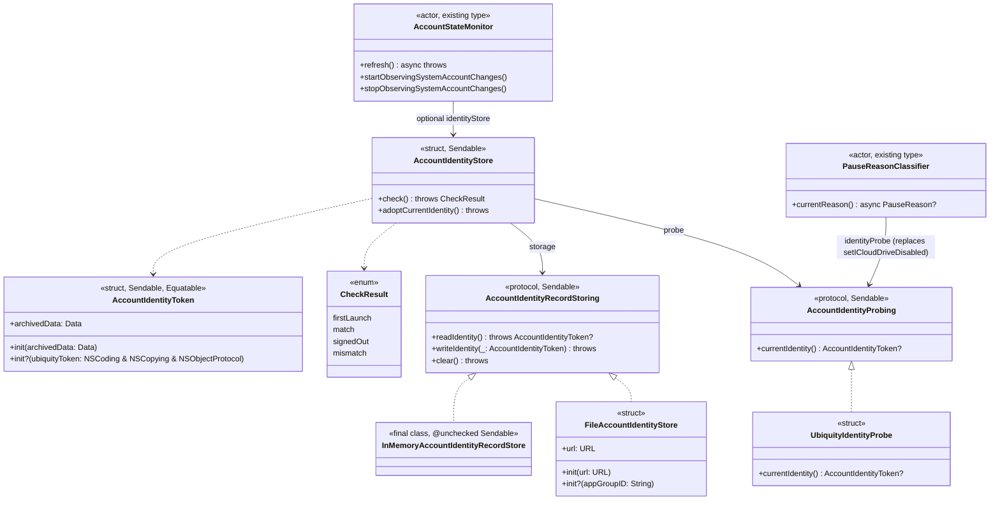
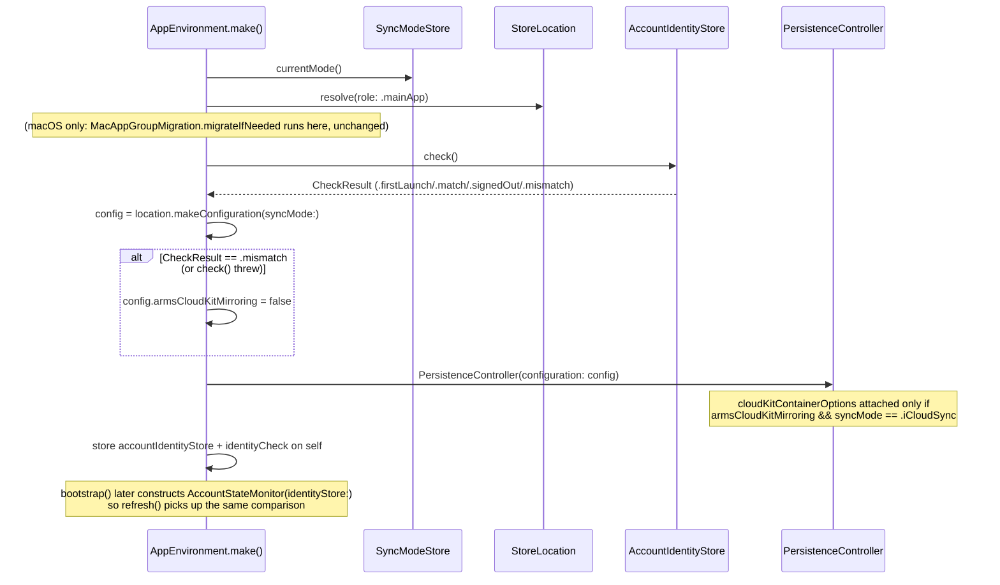

# Plan 3a — Account Identity and Status

Findings: `S3` (critical), `S13` (high), `S21` (medium), `S24` (medium).
Stories: `S3`→`LIL-13`, `S13`→`LIL-36`, `S21`→`LIL-59`, `S24`→`LIL-62`.

## 1. Why this plan exists

`S3` is the last untouched CRITICAL finding in the program: Lillist persists no
iCloud account identity anywhere. `iCloudAccountState.from` maps *any*
signed-in account to `.available`; `.accountChanged` is produced only by a
test seam (`AccountStateMonitor.simulateAccountChange()`), never in
production. A device that signs out of account A and into account B without
relaunching (or relaunches after switching) arms CloudKit mirroring against
B's private database with a local store still full of A's data — uploading
A's tasks into B's account and merging B's data down into what the user
sees.

`S13`, `S21`, `S24` are smaller, adjacent gaps in the same subsystem:
`AccountStateMonitor.refresh()` runs once per launch (no live re-probe);
`SyncStatusMonitor`'s stall counters are never cleared by a swap/reset and
the import axis never escalates the way the export axis does (issue #66);
`PauseReasonClassifier`'s `.noNetwork`/`.iCloudDriveDisabled` cases are
unreachable dead code.

## 2. `AccountIdentityStore` — type proposal

### Problem

Nothing compares "the iCloud account signed in right now" against "the
account this device's local store was last known to belong to." The
comparison must run **before** `PersistenceController` arms
`cloudKitContainerOptions` (i.e. before `NSPersistentCloudKitContainer` can
mirror anything), must be synchronous enough to sit on the cold-launch path
without a network round trip, and must be testable without a live CloudKit
account.

### Identity-source decision: `FileManager.ubiquityIdentityToken`, no fallback to `CKContainer.fetchUserRecordID`

Two candidates were evaluated per the wave brief:

| | `FileManager.ubiquityIdentityToken` | `CKContainer.fetchUserRecordID` |
|---|---|---|
| Cost | Synchronous property read, in-process | Async network round trip to Apple's servers |
| Availability | Works offline; works identically on macOS and iOS (`Foundation`, not `UIKit`-gated) | Requires network + an authorized, reachable CloudKit session |
| Entitlements | None beyond the iCloud container capability the app already has | Same |
| Privacy | Opaque token, compared only via `isEqual` — carries no account identifier | A real (container-scoped) user record name |
| Apple's own guidance | Documented specifically for "has the iCloud account changed" detection (`NSUbiquityIdentityDidChangeNotification`'s sibling API) | Documented for CloudKit record ownership, not account-change detection |

`ubiquityIdentityToken` is the primary and **only** source. A network-dependent
fallback would mean every offline cold launch either blocks on a timeout or
silently skips the safety check — worse than not having a fallback at all,
since account switching is fully possible offline (switching Apple ID in
Settings needs no network). The one documented edge case
(`ubiquityIdentityToken` reflecting iCloud Drive access, not bare CloudKit
account sign-in) is *reused*, not worked around: see §6 below, where the same
signal now also answers `S24`'s "is iCloud Drive on for this app" question —
one seam, two consumers.

### Type shape



`AccountIdentityToken` mirrors `ubiquityIdentityToken`'s own documented
comparison contract: Apple's docs say to compare two tokens via `isEqual:`,
not pointer/byte equality. Archiving to `Data` is required for durability
(the token itself is an opaque, non-`Codable` `NSObject`); `Equatable`
unarchives both sides (via `NSKeyedUnarchiver(forReadingFrom:)` with
`requiresSecureCoding = false` — the token's concrete class is a private
Apple type that only conforms to plain `NSCoding`, not `NSSecureCoding`, so
the modern `unarchivedObject(ofClasses:from:)` API — which forces
`requiresSecureCoding = true` — cannot be used without a deprecation-free
workaround) and calls `isEqual`, falling back to raw `Data` equality only if
either side fails to decode (defensive, not the primary path).

`CheckResult` has four cases, not three — `signedOut` is distinct from
`mismatch` per the wave brief: "Account signed out entirely → the existing
no-account pause path, not the mismatch path." `check()`'s truth table:

| stored | current | Result | Storage mutation |
|---|---|---|---|
| nil | nil | `.firstLaunch` | none (nothing to adopt yet) |
| nil | present | `.firstLaunch` | adopt (write current) |
| present | nil | `.signedOut` | none (never forget on a temporary sign-out) |
| present | present, equal | `.match` | none |
| present | present, different | `.mismatch` | none — `adoptCurrentIdentity()` is a separate, explicit call |

A `check()` that throws (storage I/O failure — not "no file," which
`FileAccountIdentityStore.readIdentity()` treats as a clean `nil`, matching
`FileMigrationJournalStore`'s precedent) is treated as `.mismatch` by the one
caller that gates mirroring (`AppEnvironment.make()`, §4) — fail closed, we
cannot verify safety, so we must not arm mirroring. It is *not* surfaced as
the `.accountChanged` UI state (`AccountStateMonitor.refresh()` uses `try?`
and treats a throw as "no change detected" for *display* purposes) — a
corrupted few-byte JSON file is exceptionally unlikely and conflating it with
a real account switch would show the user a misleading "your account
changed" dialog when the actual problem is a damaged cache file. This
asymmetry (fail closed for the safety gate, fail open for the status badge)
matches the existing `localTaskRowCount`/precondition-guard pattern already
in this codebase (`PersistenceController.localTaskRowCount()`'s own doc
comment: "fails closed... An uncertain count must never bypass the guard").

## 3. Mismatch-response policy — council decision

Full audit trail: `.council/s3-account-mismatch-response-policy/DECISION.md`
(unanimous 3/3 ranked-choice runoff after one deliberation round from an
initial 1-1-1 split). Summary of the binding decision:

- **Cold launch: non-blocking.** No new full-screen gate. Extend the
  existing `PauseReason.accountChanged` → badge → `PauseExplainerDialog`
  path (already built, never wired to a real signal until this plan).
  Mirroring is already suppressed for this launch by construction (§4), so a
  hard block buys no additional safety and would misuse the
  `OnboardingPresentationModifier` gate mechanism (reserved for a
  structurally-unusable store, not a merely-unmirrored one).
- **Mid-session (`S13`): automatic, silent containment before any prompt.**
  If the monitor detects a mismatch *after* cold-launch priming (i.e. while
  mirroring may already be attached and live), the app immediately runs a
  `.disableNow` transition — non-destructive to data, so it doesn't need
  user confirmation (constraint: "nothing destructive happens without
  explicit choice" governs data loss, not detaching a live connection). The
  *dismissible* explainer/resolution dialog still appears afterward.
- **Two resolution choices, both routed through existing hardened
  primitives — never a new destructive-operation type:**
  - **"Use This Account"** → a new, narrowly-scoped
    `DataStoreResetService.resolveAccountMismatchByRedownloading()`. Not the
    same as `resetAndRedownload()` — that method is left **completely
    unmodified**, because `ResetSignalMonitor`'s automatic peer-triggered
    reset calls it directly and must stay unconditionally blocked by the
    ambient `accountStateProvider` preflight when a real mismatch is active.
    The new method re-validates the mismatch is real (re-reads
    `accountStateProvider()` itself, never trusting a stale caller-held
    flag) before bypassing *only* the internal preflight for this one call.
  - **"Stay Local For Now"** → the existing
    `MigrationCoordinator.beginDisable(strategy: .now, ...)`, untouched.
- **`adoptCurrentIdentity()` timing: after success, never before, for
  either path.** Adopting early was the round-1 fault line: it would let a
  mid-reset failure's `reattachStore()` call reattach still-mismatched data
  with mirroring re-armed against the newly-adopted identity (see §5 for the
  mechanism this plan closes instead of relying on ordering alone).

Two engineering fixes are binding parts of the decision, independent of the
presentation question — every council seat converged on both independently:

1. `PersistenceHost.configuration(for:)` must stop hand-rebuilding a
   `StoreConfiguration` via the raw initializer (which defaults
   `armsCloudKitMirroring: true`) and instead derive from
   `controller.configuration.withSyncMode(_:)`, which already preserves
   `armsCloudKitMirroring` — see §5.
2. `DataStoreResetService.performReset`'s two failure-path `reattachStore()`
   calls must not silently resume mirroring against a store that may still
   hold a mismatched account's data — see §5.

## 4. Launch-sequence integration

Both platforms' `AppEnvironment.make()` gain the identity check as the very
first structural decision, before `PersistenceController` is constructed —
ahead of (iOS) the `StoreLocation.resolve` → `makeConfiguration` → controller
sequence, and ahead of (macOS) the same sequence *after*
`MacAppGroupMigration.migrateIfNeeded` (which is a pure file-system
operation on closed stores and doesn't touch CloudKit, so ordering relative
to it doesn't matter for `S3`'s purposes — it runs first, unchanged, and the
identity check runs on its result).



`AppEnvironment` gains two new stored properties: `let accountIdentityStore:
AccountIdentityStore` (so the resolution UI can call
`adoptCurrentIdentity()`) and `let accountIdentityCheck:
AccountIdentityStore.CheckResult` (captured at `make()` time, informational
— nothing currently branches on it after construction; the live signal for
UI purposes is `accountState`/`pauseReason`, which `AccountStateMonitor`
re-derives independently in `bootstrap()`). Both apps construct
`AccountStateMonitor` with `identityStore: accountIdentityStore` so
`bootstrap()`'s existing `try? await accountStateMonitor.refresh()` call
re-runs the *same* comparison and publishes `.accountChanged` through the
monitor's stream — the mechanism that was previously only reachable via the
test-only `simulateAccountChange()`.

## 5. Closing the two corroborated `PersistenceHost` leaks

**Fix 1 — `configuration(for:)` must preserve `armsCloudKitMirroring`.**
Before:

```swift
private func configuration(for newMode: SyncMode) -> StoreConfiguration {
    let url = storeURL ?? URL(fileURLWithPath: "/dev/null")
    return StoreConfiguration(
        storeKind: .onDisk(url: url),
        cloudKitContainerIdentifier: cloudKitContainerIdentifier,
        syncMode: newMode
    )  // armsCloudKitMirroring defaults to true — always, regardless of
       // what the host was originally constructed with.
}
```

After: `PersistenceHost` captures `armsCloudKitMirroring` from
`controller.configuration` at `init` (alongside the existing
`cloudKitContainerIdentifier`/`storeURL` capture) into a new stored
`private(set) var armsCloudKitMirroring: Bool`, and `configuration(for:)`
becomes `controller.configuration.withSyncMode(newMode)` — reusing
`StoreConfiguration`'s existing `with*` copy helper, which already threads
`armsCloudKitMirroring` through unchanged (per its own doc comment: "Preserves
`armsCloudKitMirroring` — a 'with' copy must not silently reset a role's
mirroring permission back to the default"). This closes the leak for
*every* `PersistenceHost` mutation path (`reconfigure`, `rebuildEmptyStore`,
`reattachStore`, `attachStore`), not just the reset flow — a `PersistenceHost`
constructed with mirroring suppressed (the `.mismatch` launch case) now
*stays* suppressed across every structural swap until something explicitly
re-arms it.

**Re-arming.** The one place mirroring must legitimately turn back on is the
successful completion of `resolveAccountMismatchByRedownloading()`
(§3) or an ordinary first-run adoption. Since `PersistenceHost` now threads
`armsCloudKitMirroring` from its *own* `controller.configuration` rather than
re-deriving a default, and the controller's configuration was only ever
suppressed for the launch that detected the mismatch, the very next cold
launch (post-adoption, `check() == .match`) constructs a fresh
`PersistenceController` with `armsCloudKitMirroring: true` normally — no
in-process "flip a bit back on" API is needed. `resolveAccountMismatchByRedownloading()`
does not attempt to re-arm mirroring in the same process at all; its
copy in the plan doc's UI wiring (§6 of the council decision) reflects that
the resolution flow's local-data wipe and re-download proceed with
whatever `armsCloudKitMirroring` this launch's host already has — which, for
the mismatch case, is `false`. That means an in-session "Use This Account"
resolution wipes and rebuilds the store **without** re-attaching mirroring
this session; the user relaunches (the existing result-text pattern
`ResetDataStoreSection` already uses for its other reset actions says
"Relaunch Lillist" for exactly this reason) and the next launch's identity
check now reads `.match`, constructing a normally-mirroring store. This is a
deliberate, minimal-surface choice — it reuses the "relaunch to complete"
UX the reset screen already trains users to expect, rather than adding new
in-process re-arm plumbing to `PersistenceHost` for a rare, already-explicit
user action.

**Fix 2 — failure-path reattaches must not resume mirroring against a
possibly-still-mismatched store.** `DataStoreResetService.performReset`'s two
`catch` blocks (zone-erase failure, `rebuildEmptyStore` failure) both call
`host.reattachStore()` unconditionally. Because Fix 1 already makes
`reattachStore()` preserve whatever `armsCloudKitMirroring` the host was
constructed with, a *normal* reset's failure-path reattach is now
automatically safe (it preserves `true`, matching pre-fix intent, since a
normal reset only ever runs when there's no mismatch). No separate
"mirroring-suppressed reattach variant" method is needed once Fix 1 lands —
that was Seat 3's proposed mechanism *before* Fix 1's existence was settled
in deliberation; Fix 1 alone closes the leak, because the host's
`armsCloudKitMirroring` is already `false` for the one call path
(`resolveAccountMismatchByRedownloading`) where a stale-account failure
reattach would otherwise be dangerous. This is confirmed in §8's test plan
(`test_S3_failedResolutionReattachDoesNotRearmMirroring`).

## 6. `S24` — real reachability + real `iCloudDriveDisabled`, using the same probe

**Reachability.** `LiveNetworkReachability` (new, `Sync/LiveNetworkReachability.swift`),
an `actor` wrapping `NWPathMonitor` — placed in `LillistCore` (not
duplicated per app target) because it imports only `Network` + `Foundation`,
mirrors the existing "wrap a non-Sendable callback API behind an
actor-isolated cache" shape `AccountStateMonitor`/`CloudKitEventBridge`
already use for their own framework types, and a single canonical
implementation is strictly better than two per-app copies for something with
zero platform-specific behavior (`NWPathMonitor` behaves identically on iOS
and macOS). This directly extends the precedent `StoreLocation` set in
Wave 1c ("the canonical resolver... in LillistCore... so future
contributors don't rediscover the shape independently per app"). Both apps
construct one instance, call `start()` during `bootstrap()`, and pass it as
`PauseReasonClassifier`'s `networkMonitor:` instead of
`ConstantNetworkReachability(reachable: true)`.

**`iCloudDriveDisabled` — remove the dead push-based setter, replace with a
pull-based probe using the *same* `AccountIdentityProbing` seam `S3`
introduced.** The existing `setICloudDriveDisabled(_:)`/`iCloudDriveDisabled`
stored `Bool` is deleted rather than wired up: no call site in the
production apps ever called the setter (confirmed by the review), and adding
one would mean remembering to call it at the right moment from somewhere —
exactly the "attractive nuisance" shape this codebase's class-killer
philosophy avoids (cf. `CascadeReaper.batchDelete`'s removal in Wave 1b).
`PauseReasonClassifier` already gains an `AccountIdentityProbing` dependency
for nothing else — reusing it here is free. `currentReason()`'s `.available`
branch becomes:

```swift
case .available: break
// ...
if identityProbe.currentIdentity() == nil { return .iCloudDriveDisabled }
if await !networkMonitor.isReachable() { return .noNetwork }
return nil
```

This is not a guess: `ubiquityIdentityToken == nil` while `CKAccountStatus ==
.available` is precisely Apple's documented distinction between "an iCloud
account is signed in" (what `CKContainer.accountStatus` reports) and "this
app has iCloud Drive/ubiquity access" (what `ubiquityIdentityToken`
reports) — the classifier's own pre-existing doc comment already said as
much ("The app probes this from `FileManager.default.ubiquityIdentityToken
== nil`") without ever being wired to fire. This is a direct, non-council
call (not "genuinely 2-sided" per the wave brief's carve-out) — removing an
unreachable mutable setter in favor of a pull-based check against a value
already computed for a different purpose is strictly simpler and closes the
"forgot to call the setter" defect class at its root.

## 7. `S21` — stall-state reset + import-axis escalation

**Reset seam.** `SyncStatusMonitor` gains `public func resetStallState()`
(clears `consecutiveExportFailures`/`consecutiveImportFailures` and both
error-forensics pairs — see below). `AppEnvironment` promotes the
`LillistCore.SyncStatusMonitor` instance to its own stored property (`let
syncStatusMonitor: SyncStatusMonitor`, alongside the existing
`CloudKitSyncStatusAdapter` wrapper that already owns one internally — the
adapter now takes the pre-built monitor instead of constructing its own) and
injects a closure `{ [syncStatusMonitor] in await syncStatusMonitor.resetStallState() }`
as a new `syncStatusReset:` constructor parameter on both
`MigrationCoordinator` and `DataStoreResetService`. Both call it exactly
where they already call `backupReconciler?.reconcileFull()` on the
successful-completion path (never on failure — a failed reconfigure/reset
hasn't actually changed anything about the store's sync health, so clearing
real stall state on a no-op failure would hide a genuine ongoing problem).
`restoreFromBackup` gets the same call on its own success path.

**Import-axis escalation.** `apply(_:)`'s non-export branch currently only
ever clears `next.error` on a recoverable failure (never escalates,
unlike the export axis's `applyExportOutcome`). Add
`consecutiveImportFailures`/`lastImportErrorDomain`/`lastImportErrorCode` and
an `applyImportOutcome(_:into:)` mirroring `applyExportOutcome` exactly
(same `stallThreshold`, same forensic-history-persists-across-success
behavior), gated on `event.type == .import`. `.setup` events keep their
existing behavior (untouched — `.setup` never had failure-streak semantics
on either axis and nothing in the review asks for that). `SyncStatus.error`
can now carry `.syncStalled` from either axis; `ExportHealth` is
generalized... actually, kept as `ExportHealth` (existing public API, other
call sites depend on its name) and a new parallel `ImportHealth` struct is
added alongside it (`public var importHealth: ImportHealth`) rather than
renaming/merging — avoids a breaking rename for an existing public type for
no behavioral gain.

## 8. Test plan (TDD, red→green, finding-referencing names)

New file `Packages/LillistCore/Tests/LillistCoreTests/Sync/AccountIdentityStoreTests.swift`:
- `test_S3_firstLaunchAdoptsSilently`
- `test_S3_firstLaunchWithNoCurrentIdentityIsANoOp`
- `test_S3_matchingIdentityReturnsMatch`
- `test_S3_signedOutIsNotAMismatch_storageUntouched`
- `test_S3_differingIdentityReturnsMismatch`
- `test_S3_adoptCurrentIdentityPersistsForNextCheck`
- `test_S3_adoptCurrentIdentityThrowsWhenSignedOut`
- `test_S3_tokenEqualityViaRoundTripArchive` (two independently-archived
  equal underlying objects compare equal; two different ones don't)
- `FileAccountIdentityStoreTests`: read-missing-is-nil, write-then-read
  round trip, atomic write survives a torn intermediate state (same
  `.atomic` guarantee as `FileReseedJournalStore`).

Extend `AccountStateMonitorTests.swift`:
- `test_S3_refreshOverridesToAccountChangedOnMismatch`
- `test_S3_refreshDoesNotOverrideOnFirstLaunchOrMatch`
- `test_S3_refreshIgnoresIdentityWhenBaseStateIsNotAvailable` (a `.noAccount`
  CKAccountStatus stays `.noAccount`, never gets promoted to
  `.accountChanged` by a stale stored identity)
- `test_S13_startObservingSystemAccountChangesTriggersRefresh` (post a real
  `Notification.Name.CKAccountChanged`, assert `refresh()` ran — drive via
  the existing `recordEvent`-style test seam, not a live `CKContainer`)
- `test_S13_stopObservingSystemAccountChangesRemovesObserver`

Extend `PersistenceHostTests`/`StoreLevelModeSwapSpike` (app-hosted, per the
existing live-swap test-host requirement) or the closest host-agnostic
equivalent:
- `test_S3_reconfigurePreservesArmsCloudKitMirroringFalse` (construct a host
  from a controller with `armsCloudKitMirroring: false`; run `reconfigure`/
  `attachStore`/`reattachStore`; assert the resulting store description
  never carries `cloudKitContainerOptions` even when `syncMode ==
  .iCloudSync`) — this is the class-kill for Fix 1.

Extend `DataStoreResetServiceTests.swift`:
- `test_S3_resolveAccountMismatchByRedownloadingRequiresActiveMismatch`
  (throws when `accountStateProvider` doesn't report `.accountChanged`)
- `test_S3_resolveAccountMismatchByRedownloadingBypassesPreflightOnce`
- `test_S3_resetAndRedownloadStillBlockedDuringActiveMismatch` (the
  unmodified public method — proves `ResetSignalMonitor`'s automatic path
  stays blocked)
- `test_S3_failedResolutionReattachDoesNotRearmMirroring` (class-kill for
  Fix 2/§5: construct the host with `armsCloudKitMirroring: false`, force
  `rebuildEmptyStore` to fail via the existing `RealWipingResetHost` fake,
  assert the failure-path `reattachStore()` produces a description with no
  `cloudKitContainerOptions`)

Extend `MigrationCoordinatorTests.swift`/`MigrationRunnerExecutingTests.swift`:
- `test_S3_replaceLocalWithICloudRefusesOnAccountChanged` (the previously
  missing preflight — mirrors the existing
  `runMigrationRejectsLowDiskSpace`-style precondition test shape)

New file `Packages/LillistCore/Tests/LillistCoreTests/Sync/SyncStatusMonitorImportEscalationTests.swift`
(or extend `SyncStatusMonitorTests.swift` directly, matching its existing
`recordRecoverableExportFailures`-style helper pattern):
- `test_S21_importStallEscalatesAtThreshold` (mirrors
  `nthFailureEscalates`, on the import axis)
- `test_S21_importStreakResetsOnSuccess`
- `test_S21_structuralImportFailureResetsStreak`
- `test_S21_exportAndImportStreaksAreIndependent` (extends the existing
  `importEventsDoNotCountTowardExportStall`, now bidirectionally)
- `test_S21_resetStallStateClearsBothAxesAndForensics`

Extend `PauseReasonClassifierTests.swift`:
- `test_S24_iCloudDriveDisabledWhenTokenNilButAccountAvailable` (replaces
  the old `setICloudDriveDisabled`-driven test with one driven by a fake
  `AccountIdentityProbing` returning `nil`)
- `test_S24_iCloudDriveEnabledWhenTokenPresent`
- existing `iCloudDrivePriority` test rewritten to drive the new probe seam
  instead of the deleted setter (two-hats: this is a mechanism swap
  necessitated by the fix itself, landed in the same commit).

New file `Packages/LillistCore/Tests/LillistCoreTests/Sync/LiveNetworkReachabilityTests.swift`:
- construction + `start()` idempotency; `isReachable()` returns the
  documented default (`true`) before `start()` is called (never falsely
  reports offline for a monitor that hasn't begun observing yet).

App-level (verified via unsigned `xcodebuild build`, not unit tests — no
host-side target reaches `AppEnvironment.bootstrap()`'s private observers,
matching the `OnboardingPresentationModifier`/`S16`/`S17` precedent from
`2a`): the mid-session auto-disable wiring, `PauseExplainerDialog`'s two new
buttons, and both `ICloudSyncPage.swift`/`ICloudSyncPane.swift` wiring
additions.

## 9. Verification (binding protocol)

```bash
export DEVELOPER_DIR=/Applications/Xcode-beta.app/Contents/Developer
swift test --package-path Packages/LillistCore --parallel --num-workers 2 > /tmp/suite.log 2>&1; echo EXIT:$?
grep -E "Test Suite .* failed|Note: Some test targets reported failures" /tmp/suite.log
```

EXIT 0 + empty grep, twice. Baseline to beat: 1235 tests / 228 suites / 89
XCTest methods (Wave 2b's closing count). Both app targets must build
unsigned (`xcodebuild ... CODE_SIGN_IDENTITY="" CODE_SIGNING_REQUIRED=NO
CODE_SIGNING_ALLOWED=NO build`) for both `Lillist-iOS` and `Lillist-macOS`.

Mikey-only manual verification (added to the ledger's living checklist):
account switch with a second Apple ID — cold launch (confirm the badge shows
`.accountChanged`, mirroring never arms, "Use This Account" wipes+redownloads
after a relaunch, "Stay Local" flips to LocalOnly cleanly) and mid-session
(sign out of A / into B while Lillist is foregrounded, confirm sync
auto-detaches within one `CKAccountChanged` delivery + the dialog appears,
never observing any of account A's rows in account B's CloudKit Console
zone).
