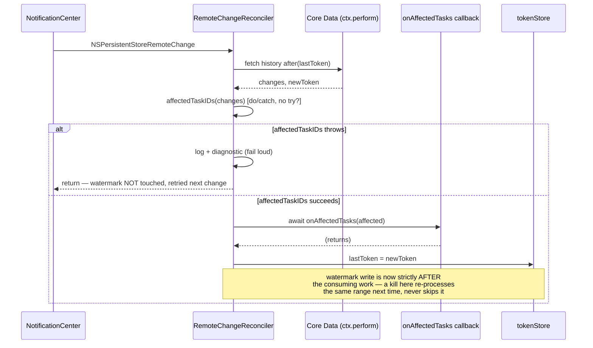
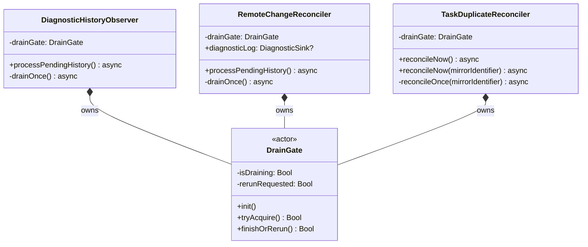

# Plan 4a — history-consumer-discipline

Findings: `H6`, `M3`. Stories: `LIL-24`, `LIL-47`. Review doc:
`docs/reviews/2026-07-28-data-sync-review.md`. Ledger:
`docs/superpowers/plans/2026-07-28-data-sync-hardening-index.md`.

Hotspots: `Persistence/RemoteChangeReconciler.swift`,
`Persistence/TaskDuplicateReconciler.swift`,
`Diagnostics/DiagnosticHistoryObserver.swift` (source of the `DrainGate`
pattern being extracted), `Persistence/PersistenceController.swift`
(`transactionAuthor` semantics), `Apps/Lillist-iOS/Sources/App/AppEnvironment.swift`
(the only place `RemoteChangeReconciler` is constructed today).

Deliberately the smallest plan in the program — two findings, one shared
mechanism (`DrainGate`) and one shared pattern (watermark-after-success),
opening chain 4 (`RemoteChangeReconciler.swift`) ahead of `4b`, which widens
the same reconcile mechanism to spec inserts/deletes and must not inherit a
mechanism that still silently loses work.

## 1. H6 — watermark advances only after successful reconcile

### The bug, precisely

`RemoteChangeReconciler.processPendingHistory()` (current shape, before this
plan):

```swift
let affected = (try? await Self.affectedTaskIDs(
    from: changes,
    localAuthor: PersistenceController.localTransactionAuthor,
    in: ctx
)) ?? []

if let newToken {
    tokenStore.lastToken = newToken     // <-- advances BEFORE the callback runs
}
if affected.isEmpty == false {
    await onAffectedTasks(affected)     // <-- the actual work, AFTER the watermark moved
}
```

Two independent defects in one block:

1. **`try?` swallows a real failure into `[]`.** `affectedTaskIDs` is declared
   `async throws` for exactly this reason (a future implementation change —
   e.g. a throwing fetch inside the diffing core — must not silently regress
   this), but the callsite discards the error and proceeds as if nothing
   were affected.
2. **The watermark write happens before the consuming work, not after.** Even
   when `affectedTaskIDs` *does* succeed, a kill/crash/termination between the
   `tokenStore.lastToken = newToken` line and `onAffectedTasks` completing
   loses that reconcile permanently — the next launch's diff starts `after:
   newToken`, so the already-consumed-on-paper history range never gets
   reprocessed.

Contrast, `LocalBackupCoordinator.processRemoteChange` (`Backup/LocalBackupCoordinator.swift:252-331`,
flagged in the review as "the correct pattern that H6 violates elsewhere; copy
it, don't reinvent it"):

```swift
// ... resolve diff, upsert/prune the backup package ...
do {
    if !projected.records.isEmpty { try await store.upsert(...) }
    ... // every consuming step
} catch {
    return   // never touches the watermark on failure
}
// Advance the watermark only after a successful apply.
if let newToken = diff.newToken {
    tokenStore.lastToken = newToken
}
```

The shape to copy: **do the work, let failures propagate and short-circuit
before any watermark write, and only write the watermark once every
consuming step for this batch has actually completed.**

### Fix



`processPendingHistory` (renamed internally to a `drainOnce()` step once `§2`
adopts `DrainGate` — see below) becomes:

```swift
let affected: [UUID]
do {
    affected = try await Self.affectedTaskIDs(
        from: changes,
        localAuthor: persistence.transactionAuthor,   // see §1b
        in: ctx
    )
} catch {
    LillistLog.store.error("RemoteChangeReconciler failed to compute affected tasks: \(String(describing: error), privacy: .public)")
    if let sink = diagnosticLog {
        await sink.log(DiagnosticEvent(..., name: "remoteChangeReconciler.affectedTaskIDsFailed", ...))
    }
    return   // do NOT advance the watermark
}

if affected.isEmpty == false {
    await onAffectedTasks(affected)
}

if let newToken {
    tokenStore.lastToken = newToken   // only reached after the above completes
}
```

New `public var diagnosticLog: DiagnosticSink?` on `RemoteChangeReconciler`,
mirroring `TaskDuplicateReconciler`'s M5 fail-loud property exactly (same
shape: unconditional `os.Logger` line + optional structured diagnostic
event). Wired in iOS `AppEnvironment.swift` right after construction
(`remoteChangeReconciler.diagnosticLog = diagnosticLog`), the only place this
type is built today.

### 1b. The `transactionAuthor` decision

**The callsite bug:** `processPendingHistory` hardcodes
`localAuthor: PersistenceController.localTransactionAuthor` — a *global
constant* ("Lillist.app") — instead of reading `persistence.transactionAuthor`,
the *specific instance's own* stamped author. `PersistenceController.transactionAuthor`
already exists precisely so each process can stamp its own writes
distinctly (`localTransactionAuthor` for the iOS app, `macAppTransactionAuthor`
for macOS, plus per-extension/CLI/widget authors — see
`PersistenceController.swift:33-49`). Hardcoding the iOS default at the
callsite means any `PersistenceController` constructed with a *different*
`transactionAuthor` would have **its own local writes misclassified as
foreign** — defeating the reconciler's own documented purpose ("so an app's
own writes don't trigger a redundant reconcile cycle").

This is a plain origin-fix, not a two-sided call: the correct value is
already sitting on the object doing the comparison (`self.persistence
.transactionAuthor`); reaching past it for a same-named global constant that
usually-but-not-always matches is the defect. Fixed by using
`persistence.transactionAuthor` instead of the hardcoded default. (No app
currently wires `RemoteChangeReconciler` with a non-default author — only
iOS constructs one, using the default — so this is a latent-but-real
correctness fix, not an observable behavior change in today's production
wiring. It removes a footgun for `4b`/future work that widens which
processes run this reconciler.)

**The semantic question the brief raised — decided directly, no council
needed:** should a *same-device, cross-process* write (e.g. a future
Share/Shortcuts-extension-authored `NotificationSpec` change, once `4b`
wires extensions into this mechanism per `X8`/`X9`) be treated as "local" (no
reconcile needed) or "foreign" (needs reconcile)?

**Foreign.** The reconciler's entire purpose is keeping *this process's*
in-memory `NotificationScheduler` state (its scheduled `UNNotificationRequest`s)
truthful relative to the persistent store. A same-device extension is a
**separate OS process** with its own memory — this process's scheduler
cannot have observed a write it made, and the only way this process learns
about it is via `NSPersistentStoreRemoteChange` (which *does* fire
cross-process on a shared App-Group store, CloudKit or not) plus this exact
history diff. The correct binary is therefore "authored by *this specific
`PersistenceController` instance*" vs. everything else — exactly what
comparing against `persistence.transactionAuthor` (this instance's own
stamped value) already produces, with no third state needed. Any
extension/CLI/widget author string is, and must remain, distinct from
whichever app-process author is doing the comparing (already true —
`shareExtensionTransactionAuthor`/`appIntentsTransactionAuthor`/
`widgetTransactionAuthor`/`cliTransactionAuthor`/`macAppTransactionAuthor`
are all distinct literals), so this fix doesn't change extension-authored
classification at all — it only fixes the case where the *comparing
process's own* author didn't match the hardcoded default. Documented here
per the brief's instruction; no `council:council-vote` invoked (one
defensible answer, not two).

### Tests (`RemoteChangeReconcilerTests.swift`)

- `H6: the watermark is not advanced until onAffectedTasks has completed` —
  the callback reads `tokenStore.lastToken` from *inside* itself and asserts
  it is still `nil`; after `processPendingHistory()` returns, asserts the
  token is now non-nil. Proves the ordering invariant directly (mechanism,
  not just end-state), no sleep/timing dependency.
- `H6: uses this controller's own transactionAuthor, not a hardcoded
  default, to classify local vs foreign writes` — constructs a
  `PersistenceController` with `transactionAuthor:
  .macAppTransactionAuthor`, writes `lastFiredAt` through that *same*
  controller's own `viewContext`, and asserts `onAffectedTasks` is never
  called. Red under the old hardcoded-`localTransactionAuthor` comparison
  (that write's author, "Lillist.macApp", doesn't match "Lillist.app", so it
  would have been misclassified as foreign); green after.

## 2. M3 — DrainGate extraction + adoption (re-entrancy)

### Class-killer proposal: extract `DiagnosticHistoryObserver.DrainGate`

`DiagnosticHistoryObserver` already solved this exact problem for its own
consumption of `NSPersistentStoreRemoteChange` (see its doc comment: "A burst
of notifications spawns several `Task { await processPendingHistory() }`
calls on arbitrary threads; without this they would race the split token
read-modify-write... and double-emit"). `RemoteChangeReconciler` and
`TaskDuplicateReconciler` both spawn the identical unstructured
`Task { await self.X() }` per notification with **no** such guard — the
exact shape `DiagnosticHistoryObserver` already fixed once, privately.
Extracting its private nested `DrainGate` actor into a public `LillistCore`
type and adopting it in all three consumers is a genuine class-kill: the
same re-entrancy defect cannot recur in a fourth future consumer without
deliberately not reaching for this type.



`DrainGate` (new file `Persistence/DrainGate.swift`) is deliberately minimal —
exactly the two methods `DiagnosticHistoryObserver` already proved correct,
made `public` with no behavior change:

```swift
public actor DrainGate {
    private var isDraining = false
    private var rerunRequested = false
    public init() {}
    public func tryAcquire() -> Bool { ... }      // unchanged body
    public func finishOrRerun() -> Bool { ... }   // unchanged body
}
```

Each consumer keeps its own `acquire → loop-until-no-rerun → return` wrapper
(not a shared `run(_:)` higher-order method) because the three consumers'
"one pass" bodies have different shapes and different failure handling — a
shared closure-taking wrapper would need `@Sendable` closures capturing
consumer-specific state across an actor-isolation boundary for no real
benefit over each consumer writing its own four-line loop, which is what
`DiagnosticHistoryObserver` already does and what this plan ports verbatim.

### `RemoteChangeReconciler` adoption

`processPendingHistory()` becomes the acquire/loop wrapper; today's body
(already restructured for H6 in `§1`) becomes `private func drainOnce()
async`. Fixes "watermark regression" precisely: without the gate, two
concurrent drains can each read the *same* stale `tokenStore.lastToken`
inside their own `ctx.perform` (the read-modify-write is split across an
`await` boundary, exactly `DiagnosticHistoryObserver`'s own doc comment's
concern), each independently call `onAffectedTasks` with the same affected
set (a duplicate pass), and whichever finishes last can overwrite a
newer token with an older one. `DrainGate` collapses any notifications that
arrive while a drain is in flight into exactly one coalesced rerun, so the
read/fetch/advance sequence is atomic with respect to other drains despite
the intervening suspension points — identical reasoning to
`DiagnosticHistoryObserver`'s own doc comment, now shared instead of
duplicated.

### `TaskDuplicateReconciler` adoption

`reconcileNow()` (zero-arg, the production/`NotificationCenter` entry point)
and `reconcileNow(mirrorIdentifier:)` (the test seam) both route through the
*same* gate — the internal seam is where the gate lives, so a test driving
it directly still exercises the real serialization:

```swift
public func reconcileNow() async {
    await reconcileNow(mirrorIdentifier: persistence.container as? NSPersistentCloudKitContainer)
}

func reconcileNow(mirrorIdentifier: (any MirroredObjectIdentifying)?) async {
    guard await drainGate.tryAcquire() else { return }
    while true {
        await reconcileOnce(mirrorIdentifier: mirrorIdentifier)
        if await drainGate.finishOrRerun() { continue }
        return
    }
}
```

**Correctness vs. thrash, verified against the actual mechanism, not
assumed:** `NSManagedObjectContext.perform` serializes execution on the
context's own private queue — two concurrent calls into
`TaskDuplicateReconciler.reconcileDuplicates(in:mirrorIdentifier:)` (one
`ctx.perform` block each, fetch+merge+delete+save all inside it) cannot
interleave and cannot corrupt state even without `DrainGate`; the review's
"double-process"/"watermark regression" language is `RemoteChangeReconciler`-
specific (`§2` above — that reconciler's watermark write sits *outside* the
`ctx.perform` block it reads from). `TaskDuplicateReconciler`'s M3 defect is
real but purely non-functional: bursty remote-change delivery (e.g. 24
notifications arriving as a batch) spawns 24 independent full `LillistTask`
table scans back-to-back with no coalescing — "thrash the main queue with
full scans," exactly as the review names it. `DrainGate` collapses N
concurrent calls into the one owning pass plus at most a small, bounded
number of coalesced reruns (not N independent scans), which is the
regression test's actual assertion (below) — a genuine, deterministically
provable reduction, not a vaguer "no crash" claim that would already hold
pre-fix.

### Tests

- `DrainGateTests.swift` (new) — the extracted type's own contract in
  isolation, no Core Data: first `tryAcquire()` wins; concurrent
  `tryAcquire()` calls while draining all return `false` and set exactly one
  pending rerun; `finishOrRerun()` consumes the rerun flag exactly once.
- `RemoteChangeReconcilerTests.swift`, `M3: concurrent processPendingHistory
  calls process each change exactly once, no watermark regression` — fires
  24 concurrent `processPendingHistory()` calls against several foreign
  `lastFiredAt` writes (`withTaskGroup`, same technique
  `DiagnosticHistoryObserverTests.test_concurrent_processPendingHistory_emits_each_change_exactly_once`
  already validated for the same gate), asserts every affected task id is
  reconciled exactly once across the flood, then asserts a subsequent
  settled call triggers nothing further (watermark did not regress).
- `TaskDuplicateReconcilerTests.swift`, `M3: concurrent reconcileNow calls
  collapse into a bounded number of full-table passes, not one per
  notification` — an intentionally ambiguous (never-resolving) duplicate
  group + a call-counting `MirroredObjectIdentifying` wrapper; fires 24
  concurrent `reconcileNow(mirrorIdentifier:)` calls and asserts the
  counted pass count is small (≤ a fixed, generous bound) rather than 24 —
  red under today's ungated code (exactly 24, one per call), green once
  `DrainGate` coalesces the burst.

## Commit plan

1. `docs(plans): plan-4a history-consumer-discipline` — this document.
2. `fix(core): RemoteChangeReconciler advances its watermark only after a
   successful reconcile (H6)` — ordering fix, `persistence.transactionAuthor`
   fix, fail-loud `diagnosticLog`, iOS `AppEnvironment` wiring. Regression
   tests included, full suite green.
3. `refactor(core): extract DiagnosticHistoryObserver's DrainGate into a
   public LillistCore type` — pure mechanism move, zero behavior change,
   `DiagnosticHistoryObserverTests` unchanged and still green, new
   `DrainGateTests.swift`.
4. `fix(core): serialize and coalesce concurrent remote-change drains in
   RemoteChangeReconciler and TaskDuplicateReconciler (M3)` — adopt
   `DrainGate` in both; concurrent-flood regression tests for both; full
   suite green twice in a row per the binding verification protocol.
5. `chore(stories): move plan-4a stories to done`.

## Verification

Per the ledger's binding *Verification protocol*: unmasked exit code +
`grep` for XCTest failure markers, run twice after the final code commit
(step 4) since it touches shared re-entrancy behavior exercised under
`--parallel`.

```bash
export DEVELOPER_DIR=/Applications/Xcode-beta.app/Contents/Developer
swift test --package-path Packages/LillistCore --parallel --num-workers 2 > /tmp/suite.log 2>&1; echo EXIT:$?
grep -E "Test Suite .* failed|Note: Some test targets reported failures" /tmp/suite.log
```

No app-target changes are expected beyond the one-line iOS
`AppEnvironment.swift` diagnosticLog wiring in step 2 — an unsigned
`xcodebuild build` for `Lillist-iOS` confirms it still compiles.

## Discovered, out-of-scope residual — not fixed here

`TaskDuplicateReconciler.diagnosticLog` (the M5/Wave-1a fail-loud property)
is **never wired** in either `AppEnvironment.swift` — `taskDuplicateReconciler`
is constructed and started in both apps, but nothing ever assigns its
`diagnosticLog`, so a real M5 reconcile failure today logs via `os.Logger`
only and never reaches the structured diagnostic stream. Adjacent to this
plan's own `RemoteChangeReconciler.diagnosticLog` wiring but a distinct,
pre-existing gap from a different wave's fix, not part of either `H6` or
`M3`'s mechanism — flagged for the `6a` completeness sweep rather than fixed
here, matching the `LIL-77`/`LIL-81` precedent for adjacent-but-unrelated
discoveries.

## What `4b` (`notification-truthfulness`) needs to know

- `RemoteChangeReconciler.processPendingHistory()`'s body is now
  `private func drainOnce()`, wrapped by an acquire/loop pair reading
  `drainGate.tryAcquire()`/`finishOrRerun()`. `4b`'s widened diffing (spec
  inserts/deletes, task soft-deletes) belongs inside `drainOnce()`, not as a
  parallel code path — it inherits the watermark-after-success ordering and
  the serialization for free only if it stays inside that function.
- `affectedTaskIDs`'s `localAuthor` parameter is now called with
  `persistence.transactionAuthor` at the one production callsite. Any new
  callsite `4b` adds (e.g. if it needs a second diffing pass) must do the
  same — never reintroduce the hardcoded `PersistenceController
  .localTransactionAuthor` default.
- `RemoteChangeReconciler` now has a `public var diagnosticLog:
  DiagnosticSink?`, wired in iOS `AppEnvironment.swift` only (macOS has no
  `RemoteChangeReconciler` yet — `4b` is where that changes, per the ledger's
  chain-4 note and `X9`). Wire the same property when macOS gains one.
- `Persistence/DrainGate.swift` is the shared serialization primitive for
  *any* `NSPersistentStoreRemoteChange` consumer. A macOS
  `RemoteChangeReconciler` instance `4b` constructs gets its own `DrainGate`
  instance (one per consumer instance, not a shared singleton — matches
  `DiagnosticHistoryObserver`'s existing per-instance ownership).
