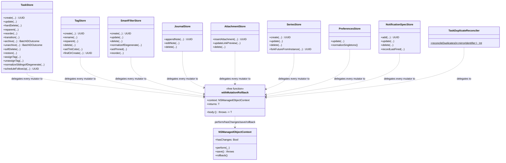

# Plan 5a — mutation-scope-discipline

Closes findings `H5 M4 M6 M7 L3 L4 L5 X19 X20` from the 2026-07-28 data & sync
hardening review (`docs/reviews/2026-07-28-data-sync-review.md`). Fourth and
final plan in the `TaskStore.swift` serial chain (`1a` → `1b` → `4b` → `5a`,
per the ledger's *Shared-file serial chains* section) — this plan is the last
one scheduled to touch `TaskStore.swift`.

Story IDs (all moved to `in-progress` before this doc was committed):
`H5`→`LIL-23`, `M4`→`LIL-48`, `M6`→`LIL-50`, `M7`→`LIL-51`, `X19`→`LIL-68`,
`X20`→`LIL-69`, `L3`→`LIL-72`, `L4`→`LIL-73`, `L5`→`LIL-74`.

## 1. Why this plan exists

Every store in `LillistCore` shares **one** `NSPersistentCloudKitContainer
.viewContext`. `TaskStore` already has a rollback-on-throw pattern
(`do { try await context.perform { mutate; try context.save() } } catch {
await context.perform { context.rollback() }; throw error }`), repeated by
hand in every mutating method. The other five stores — `TagStore`,
`SmartFilterStore`, `JournalStore`, `AttachmentStore`, `SeriesStore` — have
**no such pattern at all**: they mutate and save, and on a throw (from a
validation guard, a fetch miss, or the save itself), whatever was mutated
stays dirty on the shared context. The **next** unrelated `save()` call from
*any* store — including a read/maintenance path that shouldn't be saving at
all (`X19`) — commits that half-built row.

`TaskStore`'s own pattern has a symmetric bug: `create`'s `validateTitle`
throw happens **before** the method ever touches `context.perform`, yet the
catch block still unconditionally calls `context.rollback()`. Since
`context.perform` blocks are serialized by Core Data (one call's block runs
to completion before the next queued block starts), the *only* way this
rollback can discard someone else's legitimate work is if that other party's
`context.perform` submission is queued and runs between the throw and the
catch's own `context.perform { rollback() }` submission — a real race under
concurrent callers, not a hypothetical one.

`PreferencesStore.read()` performs writes (`M4`) — a nominal read path that
lazily creates the singleton row, called reactively on every remote-change
notification. `TaskStore.reorder`'s `.explicit(parent)` mode has no
single-anchor parent-consistency guard (`M6`). `AttachmentStore.delete`
orphans a Nullify-related `JournalEntry` it created (`M7`, verified against
the model: `Attachment.journalEntry` is `deletionRule="Nullify"`).
`PreferencesStore.normalizeSingletons`'s survivor tie-break sorts by raw
UUID bytes, which can both discard the canonical `singletonID` row in favor
of a legacy one, and fails to converge deterministically across devices when
two rows race to create the canonical id concurrently (`X20`). `syncCounts`
materializes every task's `NSManagedObjectID` on the main-queue `viewContext`
(`L3`). `unassignTag` writes unconditionally, unlike its `assignTag` sibling
(`L4`). `archive`/`unarchive` abort the whole batch — via the shared
context's own required rollback — the moment one id in the batch is missing,
even though most of the batch could have legitimately succeeded (`L5`).

## 2. Class-killer decision (already made — see ledger)

The ledger's *Class-killer verdicts* table already resolved the design
question for this plan with no council vote needed:

> Full `MutationContext` re-architecture — **Reject** → `withMutationRollback`
> helper + conformance test + logged tech debt.

A full re-architecture (e.g., one private child context per logical mutation,
merged into `viewContext` only on success) would structurally eliminate
cross-store contamination, but it's a different concurrency model for every
store's fetch/mutate/save cycle, touching every call site's assumptions about
object identity (`NSManagedObjectID` validity across contexts,
`context.perform` reentrancy) — the kind of "full type-system change" this
program's `CLAUDE.md` house rule reserves for a dedicated proposal + UML
review of its own, not a line item inside a 9-finding remediation plan. The
pragmatic fix — generalize `TaskStore`'s already-proven pattern into one
helper, adopt it everywhere, and add a structural test that fails the build
the moment a new method bypasses it — closes every concrete failure mode in
this plan's finding list without changing the concurrency model. The
residual risk this doesn't cover (a hypothetical future method that mutates
managed objects across an `await` gap *without* going through the helper at
all, leaving the context dirty for an unbounded window) is logged as
deliberate tech debt below (§8).

## 3. `withMutationRollback` — type proposal

### 3.1 Shape

One `internal` free function (not a method on any store — several stores
need it, and `TaskDuplicateReconciler.reconcileDuplicates` needs it against
an arbitrary caller-supplied context, not a store's own `context` property),
in a new file:

`Packages/LillistCore/Sources/LillistCore/Persistence/MutationRollback.swift`

```swift
/// Runs `body` on `context`'s queue as one atomic mutate-then-save scope,
/// saving only if `body` actually dirtied the context, and rolling back on
/// any throw (from `body` or from the save itself) — but ONLY if the
/// context has uncommitted changes at that moment.
///
/// The `hasChanges` guard on rollback is the fix for H5's TaskStore wart:
/// a throw that happens BEFORE `body` has touched the context (e.g. an
/// early validation failure) must not discard whatever another,
/// legitimately in-flight `withMutationRollback` call had already staged
/// on the shared `viewContext` — Core Data's `rollback()` is context-wide,
/// not scoped to the objects a specific caller touched. Under this
/// helper's own invariant (every mutator saves-or-rolls-back within the
/// same atomic `perform` scope it mutated in — never a bare, unguarded
/// context.save()/mutate elsewhere) `hasChanges` is only ever true because
/// of THIS call's own body, so the guard is provably safe, not just
/// defensively cheap.
///
/// The `hasChanges` guard on save (skip saving when body made no changes)
/// is the fix for X19's "scoped save" complaint applied structurally: a
/// no-op body (an early-return guard, an idempotent no-op mutation) never
/// calls `context.save()` at all, so it can never commit unrelated staged
/// work as an accidental side effect of doing nothing.
func withMutationRollback<T: Sendable>(
    context: NSManagedObjectContext,
    _ body: @escaping @Sendable () throws -> T
) async throws -> T {
    do {
        return try await context.perform {
            let value = try body()
            if context.hasChanges {
                try context.save()
            }
            return value
        }
    } catch {
        await context.perform {
            if context.hasChanges {
                context.rollback()
            }
        }
        throw error
    }
}
```

### 3.2 Adoption contract

- Every public mutating method on every store wraps its
  fetch/validate/mutate logic in `body`, returning whatever value the method
  needs post-save (an id, an affected-ids array, a captured diagnostic
  value) — exactly `TaskStore`'s existing return-a-tuple-from-perform shape,
  just without the method also calling `context.save()`/`context.rollback()`
  itself.
- Async side effects that must run *after* the save is durable
  (`notificationScheduler.reconcile`, `recordCrumb`, `emitDiag`) stay
  **outside** `withMutationRollback`, in the caller's own `do`/`catch` —
  unchanged from `TaskStore`'s current shape, just no longer duplicating the
  rollback call. `TaskStore`'s outer `catch` blocks drop their
  `await context.perform { context.rollback() }` lines entirely — rollback
  now happens exactly once, inside the helper, guarded by `hasChanges`. This
  is what actually fixes the `create`/`validateTitle` wart: `validateTitle`
  moves inside `body`, so a validation throw is `body`'s own throw, handled
  by the same guarded rollback as every other failure mode — there is no
  separate "did we even touch the context" case to get wrong anymore.
- `TaskDuplicateReconciler.reconcileDuplicates(in:mirrorIdentifier:)` (a
  `nonisolated static` function over a caller-supplied context, not a store
  instance) calls `withMutationRollback(context: ctx) { ... }` the same way —
  closing the gap where a failed reconcile save left re-pointed
  relationships and pending deletes dirty on the context with no rollback at
  all (a second instance of `H5`'s failure mode, not previously named
  because `TaskDuplicateReconciler` isn't one of the five "stores").

### 3.3 UML



`PreferencesStore.read()` and every other genuinely-read-only method (`fetch`,
`list`, `children`, `tagIDs`, `instances`, `specs(forTask:)`, `trashed`, …)
are deliberately **not** in this diagram or the adoption list — they never
call `withMutationRollback` because they never call `context.save()`. That
absence is the point (`M4`, `X19`).

## 4. Conformance test — class-kill design

Swift's plain (non-`@objc`) final classes give no runtime method-list
reflection, so a `Mirror`-based "enumerate every method" check (the
technique `1d`'s model-derived export-completeness test used against
`NSManagedObjectModel`, a real runtime object) isn't available here — there
is no equivalent runtime object for "the methods of a Swift class." The
mechanical, drift-proof alternative: a **source-text scan**.

New test file:
`Packages/LillistCore/Tests/LillistCoreTests/Persistence/MutationRollbackConformanceTests.swift`

- Enumerates every source file that legitimately mutates the shared
  `viewContext` (the list below), reads each file's contents via
  `String(contentsOfFile:)` (paths resolved relative to `#filePath`, the same
  technique `Tools/CI/check-*.sh` scripts use for repo-relative paths from a
  Swift file), and asserts that **no line contains a direct `.save()` or
  `.rollback()` call on `context`/`ctx`** — every save and every rollback
  must happen inside `MutationRollback.swift` itself.
- The scanned-file list is the completeness enumeration: `TaskStore.swift`,
  `TaskStore+FollowUp.swift`, `TagStore.swift`, `TagStore+FindOrCreate.swift`,
  `SmartFilterStore.swift`, `JournalStore.swift`, `AttachmentStore.swift`,
  `SeriesStore.swift`, `PreferencesStore.swift`, `NotificationSpecStore.swift`,
  `TaskDuplicateReconciler.swift`. A test asserts this list's file-existence
  (fails loudly if a listed file is ever renamed/moved without updating the
  test) and a second, separate test walks every `.swift` file under
  `Stores/`, `Notifications/`, and the `TaskDuplicateReconciler.swift` path
  and asserts each one is either in the enumerated list or contains no
  `context.save()`/`ctx.save()`/`.rollback()` call — so a **new** file added
  to those directories with its own raw save is caught automatically, not
  just files already known about.
- This is the bypass detector: a future method that calls
  `try context.save()` directly instead of going through
  `withMutationRollback` fails this test immediately, at the source-text
  level, regardless of whether anyone writes a behavioral test for that
  specific method. It fails the **build's tests**, per the wave brief's
  literal requirement, not just a specific finding's regression test.
- Layered on top, per-store **behavioral** regression tests (one per
  finding, per the *Method* binding requirement's finding-referencing test
  names) prove the mechanism actually rolls back real half-built rows, not
  just that the source text looks right — e.g. staging a legitimate
  unsaved insert on the context, then driving a store method into a
  guaranteed mid-mutation throw, and asserting `context.hasChanges == false`
  afterward AND that the pre-staged legitimate insert full round-trips as
  its own eventual save.
- **Explicitly out of scope, logged, not silently dropped:**
  `SmartFilterStore+Defaults.swift` (`installDefaultsIfNeeded`,
  `deduplicateExactDuplicates`) calls no raw `context.save()` — it composes
  `create`/`delete`, which do — so it needs no entry in the scanned list.
  `TaskStore+Queries.swift` is read-only (verified: no `.save()` anywhere) —
  same reasoning, no entry needed. Both are still covered transitively by the
  "walk every file, exempt only the enumerated list" test, so if either ever
  grows a raw save call, the walker catches it without a plan-doc update.

**Class-kill demonstration (per the wave brief, not committed):** once the
helper and conformance test land, temporarily reintroduce a raw
`try context.save()` in one store method (bypassing the helper), confirm
`MutationRollbackConformanceTests` fails on that exact line, then revert.
Recorded in the closing report, not committed.

## 5. `M4` — `PreferencesStore.read()` becomes genuinely read-only

- `read()` no longer calls `fetchOrCreateSingleton` (which inserts + saves).
  It fetches the canonical `singletonID` row; if absent, falls back to
  reading (not adopting) the first legacy row for backward-compatible
  display; if the store is completely empty, returns an in-memory `Prefs`
  built from the same default literals `fetchOrCreateSingleton` used to
  write — a caller reading prefs on a store that hasn't run maintenance yet
  sees sensible defaults, not a thrown error, and (this is the fix) **no
  write happens as a side effect of asking**.
- Creation/adoption moves into `normalizeSingletons()`. **Correction found
  during implementation:** only iOS's `bootstrap()` already calls it (right
  before its own `preferencesStore.read()` call); macOS's `bootstrap()` calls
  `preferencesStore.read()` directly with no `normalizeSingletons()` call at
  all — meaning, pre-fix, macOS relied entirely on `read()`'s now-removed
  create-on-read side effect to ever materialize the canonical row on a
  fresh install. Fixed as part of this plan: macOS's `bootstrap()` gains the
  same `try? await preferencesStore.normalizeSingletons()` call, in the same
  relative position iOS already has it (right after
  `preferencesPartitionMigrator.runIfNeeded()`, right before its own
  `preferencesStore.read()` call) — see the *Shared-file serial chains*
  ledger entry for `AppEnvironment.swift`'s current bootstrap ordering before
  touching either copy again. `normalizeSingletons()` is extended to also
  handle the zero-row case (today it's a silent no-op:
  `guard let survivor = rows.first else { return }`).
  `normalizeSingletons()` becomes the **only** place `AppPreferences` rows
  are ever created or id-adopted; `update(_:)` keeps using a rewritten
  `ensureSingleton(in:)` helper (create-if-missing is legitimate there — it's
  already an explicit mutation, not a read) but the shared row-creation
  literals move into one private factory both call, so `read()`'s in-memory
  default path, `ensureSingleton`'s creation path, and the old
  `fetchOrCreateSingleton`'s literals never drift apart.
- `PreferencesStore`'s reactive remote-change observer (constructor) still
  calls `read()` on every `NSPersistentStoreRemoteChange` — now provably
  side-effect-free.

## 6. `X20` — deterministic, canonical-first survivor selection

**Correction found during implementation:** this section originally sketched
a `createdAt`-then-`id` tie-break. Re-reading `AppPreferences`'s actual model
entry (`Model/LillistModel.xcdatamodeld/LillistModel.xcdatamodel/contents`)
before writing the code — per the house rule of reading a file fresh before
each edit pass — showed it has **no timestamp attribute of any kind**, only
`id` plus the settings fields themselves. Adding one is a real CloudKit
schema change (new synced field, Development→Production redeployment) —
exactly the kind of change `4b` explicitly deferred out of its own scope for
`X10`/`LIL-83` under the binding "flag data-model changes to the
orchestrator first" constraint. No such change is made here either; the
design below uses only fields the model already has.

`normalizeSingletons`'s new selection rule, replacing the raw-byte `id`
sort:

1. Fetch all `AppPreferences` rows.
2. Sort by the tuple `(isCanonical descending, contentKey ascending,
   id.uuidString ascending)`, where `isCanonical = (id == singletonID)` and
   `contentKey` is a canonical string built by concatenating every settings
   field in a fixed, documented order (`PreferencesStore.contentKey(_:)`).
3. Survivor = first row after sorting.

This gives, in order of precedence:

- **A row already carrying `singletonID` always wins**, regardless of how
  many legacy rows exist or what their ids sort as — fixes the "~32% of
  legacy UUIDs sort below the fixed singleton ID" defect directly: identity
  is no longer decided by raw-byte comparison at all.
- **Two rows that both carry `singletonID`** (the concurrent-create race: two
  devices independently ran the create-if-missing path before either synced)
  tie-break on `contentKey` ascending, then `id.uuidString` (a no-op in this
  specific sub-case, since both ids are literally equal) as the final,
  purely mechanical fallback. Every field `contentKey` reads is a regular
  synced `AppPreferences` attribute, so once CloudKit has propagated both
  rows to both devices, every device computes the identical key for each row
  and picks the identical survivor — content-based rather than
  creation-time-based, but still a total, convergent order, which is what
  "every device picks the SAME survivor" actually requires (not that the
  pick be temporally meaningful).
- **All-legacy rows, no canonical row yet** — same `(contentKey, id)`
  tie-break decides which one gets promoted to `singletonID`.

**Decided directly, no council vote** — two alternatives were considered:
(a) the content-key approach above, pure Core Data, no new dependency, works
identically under the in-memory test store; (b) a CloudKit-`recordName`-based
tie-break (mirroring `TaskDuplicateReconciler`'s `MirroredObjectIdentifying`
seam). (b) was rejected: it needs a live `CKContainer` at the call site,
breaking `normalizeSingletons`'s pure-Core-Data testability for a narrow
concurrent-race edge case that doesn't warrant the added complexity —
`TaskDuplicateReconciler`'s own design doc reasoned through this exact
trade-off already, and the reasoning transfers directly. "Prefer the row
already carrying the canonical id" is separately dictated by
`PreferencesStore.singletonID`'s own doc comment ("never regenerate it;
existing stores depend on it").

## 7. Other findings — fix shape (no open design questions)

- **`M6`** — `TaskStore.reorder`: add a guard, adjacent to the existing
  both-anchors parent-mismatch check (`a.parent?.objectID !=
  b.parent?.objectID` → throw), covering the single-anchor `.explicit(pid)`
  case: if exactly one of `afterTask`/`beforeTask` is present and its
  `.parent?.id != pid`, throw the same
  `LillistError.validationFailed([.init(field: "neighbors", message:
  "must share the same parent")])` — unconditional throw, no heal attempt,
  matching the both-anchors case's own behavior (that case never attempts to
  heal a cross-group mismatch either). Placed before the tie/inversion
  heal-then-recheck block, at the same point the existing both-anchors check
  runs, so a wrong-group anchor is rejected before any recompaction is
  attempted against the wrong group.
- **`M7`** — `AttachmentStore.delete(id:)`: fetch `m.journalEntry` before
  `context.delete(m)`; if non-nil, `context.delete(journalEntry)` too. The
  entry exists only to represent the attachment (created by
  `insertAttachment` in the same transaction as the attachment itself), so it
  dies with it — a normal in-context cascade-by-hand, no `CascadeReaper`
  needed (that type exists for *trash-barrier-aware* cascades; this is an
  unconditional 1:1 lifecycle pairing). No CloudKit implications: this is an
  ordinary `context.delete` inside the same save, propagated like any other
  delete.
- **`L3`** — `TaskStore.syncCounts()`: move the `objectID` fetch and
  `cloud.recordIDs(for:)` call onto `persistence.makeBackgroundContext()`
  (the same background-context factory `TrashPurger`/`batchPurge` already
  use), off the main-queue `viewContext`. `local`'s count query moves to the
  same background context for a single round trip. "Count-only where
  possible" is already true for `local`; `mirrored` has no count-only API —
  `NSPersistentCloudKitContainer.recordIDs(for:)` requires object identities
  as input, there is no CloudKit-mirrored-count-only entry point — decided
  directly, dictated by the only API surface Core Data/CloudKit expose here.
- **`L4`** — `TaskStore.unassignTag`: mirror `assignTag`'s existing
  `if existing.contains(tag) { return }` guard with
  `if !existing.contains(tag) { return }` before mutating/saving.
- **`L5`** — `TaskStore.archive`/`unarchive`: `fetchManagedObject`'s
  `.notFound` throw currently aborts the whole batch (and, pre-`withMutationRollback`,
  rolls back everything already flipped in the same loop since the throw
  happens before `context.save()`). New shape: skip a missing id (`try?
  fetchManagedObject` treated as "not found → skip", not "abort"), collect
  it into a `skipped` list, and return a new
  `TaskStore.BatchIDOutcome { flipped: [UUID], skipped: [UUID] }` from both
  methods (currently `archive` returns `[UUID]`, `unarchive` returns `Void`
  — both change for symmetry and to "report, don't drop" skipped ids). Two
  app call sites (`Apps/Lillist-iOS/Sources/Tasks/TasksView.swift`,
  `Apps/Lillist-macOS/Sources/Tasks/MacTasksView.swift`) use
  `.flipped` where they previously used the bare array; both already wrap
  the call in `try?`, so a genuine infrastructure throw (not a missing id,
  which no longer throws) still degrades the same way it does today.

## 8. Deliberate tech debt (per the house rule)

**Known limitation:** `withMutationRollback`'s `hasChanges`-gated rollback is
provably correct *given* the invariant that every mutation of the shared
`viewContext` goes through this helper (or an equally-atomic
mutate-then-save-or-rollback scope with no `await` gap in between). The
conformance test enforces this invariant mechanically for every current
mutator, but does not — cannot, from source text alone — prove a *future*
method won't introduce a genuinely non-atomic pattern (mutate now, save via
a *separate* later `context.perform` call, with an `await` in between) that
the text-scan wouldn't flag as a bypass (it would still call
`context.save()` — just from inside a differently-shaped call still routed
through the helper's own save path, or worse, hand-rolled but disguised).
**Redesign trigger:** if a future finding traces back to exactly this shape
— a legitimate multi-step mutation that must leave the context dirty across
an `await` — the fix is the full `MutationContext`/child-context
re-architecture this plan rejected in §2, not another patch on top of
`withMutationRollback`. No such case exists in the codebase today (verified
during this plan's file-by-file read-through of every store).

## 9. Commit plan

1. This doc.
2. `chore(stories)`: move the 9 stories to in-progress (already done before
   this doc landed, per the binding *Method* ordering — recorded here for
   the audit trail).
3. `feat(core)`: add `withMutationRollback` + its own unit tests.
4. `fix(core)`: H5 — migrate `TaskStore`'s mutators onto the helper (fixes
   the unconditional-rollback wart as a structural consequence) + add
   `MutationRollbackConformanceTests` scoped to `TaskStore.swift` +
   `TaskStore+FollowUp.swift` + the walker test.
5. `fix(core)`: H5 — migrate `TagStore` + `TagStore+FindOrCreate.swift`.
6. `fix(core)`: H5 — migrate `SmartFilterStore`.
7. `fix(core)`: H5 — migrate `JournalStore`.
8. `fix(core)`: H5 — migrate `SeriesStore`.
9. `fix(core)`: H5 — migrate `AttachmentStore`.
10. `fix(core)`: M7 — `AttachmentStore.delete` also deletes its linked
    `JournalEntry`.
11. `fix(core)`: M4 — `PreferencesStore.read()` becomes read-only;
    `normalizeSingletons` handles the empty-store creation case.
12. `fix(core)`: X20 — deterministic canonical-first survivor tie-break.
13. `fix(core)`: H5 — migrate `PreferencesStore.update`/`normalizeSingletons`
    onto the helper.
14. `fix(core)`: X19 — `NotificationSpecStore` migrated onto the helper
    (removes the store-wide `if hasChanges { save() }` landmine).
15. `fix(core)`: X19 — `TaskDuplicateReconciler.reconcileDuplicates` rolls
    back on a failed merge save.
16. `fix(core)`: M6 — `reorder` single-anchor explicit-parent consistency
    guard.
17. `fix(core)`: L3 — `syncCounts` off the main-queue `viewContext`.
18. `fix(core)`: L4 — `unassignTag` no-op guard.
19. `fix(core)`: L5 — `archive`/`unarchive` skip-and-report semantics + both
    app call sites.
20. `chore(stories)`: move all 9 stories to done.
21. `docs(plans)`: ledger update + `HANDOFF.md` refresh for `5b`.

Each fix commit includes its own finding-referencing regression test(s) and
keeps the full `LillistCore` suite green per the binding verification
protocol before moving to the next.
