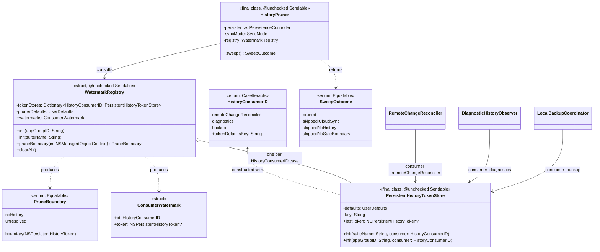

# Plan 5c — watermark-registry-pruning

Findings: `X12`, `L7`. Stories: `LIL-43`, `LIL-76`. Review doc:
`docs/reviews/2026-07-28-data-sync-review.md`. Ledger:
`docs/superpowers/plans/2026-07-28-data-sync-hardening-index.md`.

Hotspots: `Persistence/HistoryPruner.swift`,
`Persistence/PersistentHistoryTokenStore.swift`,
`Persistence/HistoryWatermarks.swift` (retired by this plan),
`Backup/LocalBackupCoordinator.swift`,
`Diagnostics/DiagnosticHistoryObserver.swift`,
`Persistence/RemoteChangeReconciler.swift` (the three registered consumers —
read, not modified), `Sync/MigrationCoordinator.swift`,
`Sync/DataStoreResetService.swift` (doc-comment references only — both
already take an opaque `historyWatermarksReset: (() async -> Void)?`
closure), `Apps/Lillist-iOS/Sources/App/AppEnvironment.swift`,
`Apps/Lillist-macOS/Sources/AppEnvironment.swift`.

The last fix plan before Wave 6 closeout. `3b` landed a deliberately narrow,
hand-maintained `HistoryWatermarks` seam ahead of this plan (see its own doc
comment and the ledger's Wave 3b closing report) specifically so `5c` could
replace it with a formal registry rather than build a second, parallel
mechanism. This plan does that replacement and, using the registry as the
foundation, fixes the ordering trap `X12` describes.

## 1. The bug, precisely

`HistoryPruner.sweep()` (current shape, before this plan):

```swift
let archived: Data? = try await ctx.perform {
    guard let token = coordinator.currentPersistentHistoryToken(fromStores: nil) else {
        return nil
    }
    let request = NSPersistentHistoryChangeRequest.deleteHistory(before: token)
    _ = try ctx.execute(request)
    return try NSKeyedArchiver.archivedData(withRootObject: token, requiringSecureCoding: true)
}
if let archived { defaults.set(archived, forKey: key) }   // never read back — L7
```

It prunes everything before `coordinator.currentPersistentHistoryToken` — i.e.
"now" — on the design premise that nothing else consumes history while the
store is `.localOnly`. That premise is false: three separate consumers
(`RemoteChangeReconciler`, `DiagnosticHistoryObserver`,
`LocalBackupCoordinator`) each maintain their own
`PersistentHistoryTokenStore` watermark and diff history independently. The
pruner runs correctly today only because both apps' `bootstrap()` happens to
call every consumer's catch-up *before* `historyPruner.sweep()`:

```swift
// AppEnvironment.bootstrap() (iOS shape; macOS orders diagnostics/reconciler
// the other way round but has the identical property — every consumer's
// catch-up precedes the sweep):
await remoteChangeReconciler.processPendingHistory(); remoteChangeReconciler.start()
...
await diagnosticHistoryObserver.processPendingHistory(); diagnosticHistoryObserver.start()
...
await localBackupCoordinator.bootstrapAtLaunch()
...
if let historyPruner = HistoryPruner(...) { _ = try? await historyPruner.sweep() }
```

This is a correctness property resting entirely on call-site ordering in a
72-line function, with no compiler or test enforcement that a future
reordering (or a new consumer added after the pruner call) can't silently
violate. `X12`'s named failure mode: a Share Extension write lands while the
main app is closed; at next launch, if anything reorders relative to the
pruner (or a consumer's own catch-up is itself incomplete/delayed — see §7),
the pruner can delete history a consumer never got to see, with no error
surfaced either way.

**`L7`, the dead-write half:** `HistoryPruner.tokenDefaultsKey`
(`app.lillist.history.prunedToken`) is written into `defaults` after every
sweep, but `sweep()` never reads it back to resume — confirmed by source
read, and by `3b`'s independent audit when it built `HistoryWatermarks`. It
is inert bookkeeping for a resume mechanism that doesn't exist.

## 2. Design: `WatermarkRegistry`

Two responsibilities, one type, replacing `HistoryWatermarks`:

1. **Reset hygiene** (what `HistoryWatermarks` already did) — `clearAll()`
   nils every registered consumer's watermark after a destructive store
   rebuild.
2. **Safe pruning** (new) — `pruneBoundary(in:)` computes the one boundary
   `HistoryPruner` needs: the earliest transaction any *registered* consumer
   has recorded as its own watermark. `HistoryPruner` deletes before that
   boundary, never before "now."

### 2.1 Closed registration

A `PersistentHistoryTokenStore` can only be constructed with a
`HistoryConsumerID` case — never an arbitrary `String` key:

```swift
public enum HistoryConsumerID: String, CaseIterable, Sendable {
    case remoteChangeReconciler = "app.lillist.persistentHistoryToken"
    case diagnostics = "app.lillist.diagnostics.historyToken"
    case backup = "app.lillist.backup.historyToken"
}

public final class PersistentHistoryTokenStore {
    public init(suiteName: String, consumer: HistoryConsumerID = .remoteChangeReconciler)
    public init(appGroupID: String, consumer: HistoryConsumerID = .remoteChangeReconciler)
}
```

This is the "single place a new consumer registers" the wave brief asks
for: adding a fourth history consumer means adding a case here, and there is
no longer a `key: String` parameter through which an off-registry string
could be typo'd into production. This is a compile-time guarantee, stronger
than a runtime assert — but it doesn't catch a *parallel* bypass: nothing
stops a future contributor from writing directly to `UserDefaults` with a
hand-typed key string that happens to match, skipping
`PersistentHistoryTokenStore` entirely. §5 covers the conformance test that
catches that residual class, mirroring `5a`'s `MutationRollbackConformanceTests`
source-text-scan precedent (no `Mirror`-based runtime enumeration exists for
a plain Swift enum's usage sites either).

### 2.2 UML



### 2.3 `pruneBoundary(in:)` algorithm

`NSPersistentHistoryToken` has no public ordering/comparison API, so "the
minimum of three opaque tokens" can't be computed by comparing them
directly. Every consumer already derives its watermark from
`transactions.last?.token` after a `fetchHistory(after:)` call whose results
are chronologically ordered (the documented Core Data contract this
codebase already relies on in all three consumers) — so a single
`fetchHistory(after: nil)` returns *every* currently-retained transaction,
oldest first, and the first one whose token matches any registered
consumer's watermark **is** the minimum, by construction of the scan order:

```swift
public func pruneBoundary(in context: NSManagedObjectContext) throws -> PruneBoundary {
    let marks = watermarks
    guard marks.allSatisfy({ $0.token != nil }) else { return .unresolved }   // §3

    let request = NSPersistentHistoryChangeRequest.fetchHistory(after: nil as NSPersistentHistoryToken?)
    guard let result = try context.execute(request) as? NSPersistentHistoryResult,
          let transactions = result.result as? [NSPersistentHistoryTransaction],
          !transactions.isEmpty
    else { return .noHistory }

    let targets = Set(marks.compactMap { $0.token }.compactMap(Self.archive))
    for txn in transactions {
        if let data = Self.archive(txn.token), targets.contains(data) {
            return .boundary(txn.token)
        }
    }
    return .unresolved   // a watermark points outside currently-retained history
}
```

Token identity is compared via `NSKeyedArchiver`-archived `Data` equality —
the same technique `PersistentHistoryTokenStore` already uses to persist
tokens, not a new comparison primitive. `deleteHistory(before:)` is
exclusive of its boundary, so the survivor transaction (the slowest
consumer's own watermark) is never itself deleted — which is what makes
re-locating it on the *next* sweep reliable even after repeated prunes.

Cost: one full history-table fetch per sweep, run only when
`syncMode == .localOnly` (this pruner is a no-op otherwise) and only once
per app launch (`bootstrap()`'s existing call site, unchanged). Unlike the
per-notification consumer diffs, this runs at most once per launch, so the
O(retained-history-size) scan is not a hot-path concern.

## 3. Min-watermark semantics, including the fresh-consumer case

| Registry / history state | `pruneBoundary` | `sweep()` outcome | Rationale |
|---|---|---|---|
| Every registered consumer has a watermark; the earliest one's transaction is present in current history | `.boundary(token)` | `.pruned` — deletes strictly before `token` | Safe: nothing registered has unconsumed history before `token`. |
| Store retains zero history transactions right now | `.noHistory` | `.skippedNoHistory` | Nothing to prune (fresh/empty store, or already fully pruned to the frontier). Mirrors the old `coordinator.currentPersistentHistoryToken == nil` short-circuit, just derived from the actual transaction list instead. |
| **At least one registered consumer has never recorded a watermark** (fresh install; a brand-new consumer added after this plan that hasn't run its first catch-up yet; right after `clearAll()` and before every consumer's next bootstrap catch-up completes) | `.unresolved` | `.skippedNoSafeBoundary` | **Fail-safe, chosen deliberately over "prune before the oldest *known* watermark."** A consumer with no watermark yet has made *zero* claims about what it has consumed — treating "no claim" as "consumed everything up to some other consumer's watermark" would be guessing, and guessing wrong destroys history a consumer hasn't seen (exactly `X12`'s failure mode). The narrow-window cost is bounded: every registered consumer's catch-up already runs earlier in the same `bootstrap()` call that runs the sweep (§4), so this state clears itself within the same launch in the common case, and it never causes data loss in the exceptional case (a consumer that's slow to catch up just delays pruning, never widens it). |
| Every consumer has a watermark, but one watermark's token can't be located anywhere in current history | `.unresolved` | `.skippedNoSafeBoundary` | Defensive, not expected in normal operation: only reachable if something *other* than this pruner deleted history a registered consumer still points into (a destructive reset that bypassed `WatermarkRegistry.clearAll()`, or CloudKit's own export-cursor pruning racing a lagging consumer across a `.localOnly` ↔ `.iCloudSync` round-trip). Refuse to guess a substitute boundary; leave history untouched until the state resolves itself. |
| `syncMode == .iCloudSync` | *(not computed)* | `.skippedICloudSync` | Unchanged from before this plan — `NSPersistentCloudKitContainer` owns pruning in this mode. |

## 4. Wiring: `HistoryPruner`, `AppEnvironment`

`HistoryPruner` gains a `registry: WatermarkRegistry` (constructed the same
way as before — App Group suite or explicit suite name for tests) in place
of the bare `defaults: UserDefaults`:

```swift
public final class HistoryPruner {
    public init(persistence: PersistenceController, syncMode: SyncMode, registry: WatermarkRegistry)
    public convenience init?(persistence: PersistenceController, syncMode: SyncMode, appGroupID: String)

    @discardableResult
    public func sweep() async throws -> SweepOutcome {
        guard syncMode == .localOnly else { return .skippedICloudSync }
        let ctx = persistence.makeBackgroundContext()
        let boundary = try await ctx.perform { try self.registry.pruneBoundary(in: ctx) }
        switch boundary {
        case .noHistory: return .skippedNoHistory
        case .unresolved: return .skippedNoSafeBoundary
        case .boundary(let token):
            try await ctx.perform { _ = try ctx.execute(NSPersistentHistoryChangeRequest.deleteHistory(before: token)) }
            return .pruned
        }
    }
}
```

Both `AppEnvironment.swift`s replace their `HistoryWatermarks(...)`
construction with `WatermarkRegistry(appGroupID: Self.appGroupID)`, built
from the *same* App Group suite the three real consumers already use — so
`clearAll()` and `pruneBoundary(in:)` read/clear the exact watermarks those
consumers maintain, not a duplicate copy (same guarantee `HistoryWatermarks`
already had, preserved verbatim). Every `PersistentHistoryTokenStore(...,
key: PersistentHistoryTokenStore.diagnosticsKey)`-shaped call site (both apps
+ every test file constructing one of the three real consumers) becomes
`PersistentHistoryTokenStore(..., consumer: .diagnostics)` (etc.) —
mechanical, no behavior change; the underlying `UserDefaults` key string is
identical (`HistoryConsumerID`'s raw value), so no on-device watermark data
is invalidated by this refactor.

`HistoryPruner`'s own construction in `bootstrap()` changes from
`HistoryPruner(persistence:syncMode:appGroupID:)` (unchanged call site — the
convenience initializer now builds a `WatermarkRegistry` internally instead
of a bare `UserDefaults`) — **no bootstrap ordering change is required by
this plan**: the fix is that `sweep()` itself no longer trusts the ordering
to be correct, not a reordering of `bootstrap()`. The existing "every
consumer's catch-up before the sweep call" arrangement remains — it's just
no longer load-bearing for correctness, only for *promptness* (see §7).

## 5. Conformance test: registry enumeration completeness

Mirrors `5a`'s `MutationRollbackConformanceTests` source-text-scan precedent
— no `Mirror`-based enumeration exists for a plain enum's call sites either.
Scans every `.swift` file under `Packages/LillistCore/Sources/LillistCore`
(same scoping as `5a`'s walker) for the three watermark key string literals
(`"app.lillist.persistentHistoryToken"`, etc.) appearing anywhere **other
than** `HistoryConsumerID`'s own declaration in `WatermarkRegistry.swift`. A
future off-registry watermark — someone hand-typing the key string directly
into a `UserDefaults` call instead of routing through
`PersistentHistoryTokenStore`/`HistoryConsumerID` — fails this test
immediately, independent of whether anyone remembers to add a behavioral
regression test for that specific bypass.

## 6. `L7`'s dead-write key — verdict: remove, don't resurrect

`HistoryPruner`'s own `tokenDefaultsKey` bookkeeping write is deleted
outright, not "made real." Once the prune boundary comes from
`WatermarkRegistry.pruneBoundary(in:)` (derived from the three real
consumers' own persisted watermarks — themselves already the source of
truth), there is no remaining purpose a fourth, pruner-owned watermark could
serve: it would either (a) duplicate the registry's own min-computation for
no benefit, or (b) reintroduce exactly the "prune before some cached notion
of *my own* progress, ignoring the consumers" bug this plan closes, just
with an extra layer of indirection. The constant is kept, `internal` (not
`public`), *only* as `HistoryPruner.legacyBookkeepingKey`, so
`WatermarkRegistry.clearAll()` can still purge the stale key from any
already-deployed install that wrote it before this plan (this repo has no
public users yet — Mikey's own devices — so this is pure hygiene, not a
real migration hazard) — matching `HistoryWatermarks.clearAll()`'s existing
behavior exactly, just re-homed. `sweep()` never reads this key again, in
either the old or new implementation — that half of `L7` was never real
either way.

## 7. Discovered, out-of-scope residual — flagged, not fixed here

`LocalBackupCoordinator.bootstrapAtLaunch()` calls `start()` (registers live
`NSManagedObjectContextDidSave`/`NSPersistentStoreRemoteChange` observers),
`seedPackageIfEmpty()`, and `runSnapshotIfDue()` — but, unlike
`RemoteChangeReconciler`/`DiagnosticHistoryObserver`, it never calls its own
`processRemoteChange()` as an explicit catch-up pass at launch. This is
precisely what `X12`'s finding text means by "the backup coordinator only
catches up via history observers": its watermark only ever advances when a
*live* notification fires while the app happens to be running, never as a
launch-time backlog sweep. This plan's registry-gated pruner directly closes
the *data-loss* half of `X12` regardless (a stale backup watermark now
correctly blocks the sweep from pruning past it, via `.skippedNoSafeBoundary`/
a stale-but-present `.boundary`, instead of the old code deleting past it
blindly) — but the underlying staleness is still real: if no future
`NSPersistentStoreRemoteChange` happens to fire, the backup consumer's
watermark (and therefore pruning) stays stalled indefinitely, trading
`X12`'s silent data loss for silent unbounded history growth instead of
truly resolving it. Fixing `LocalBackupCoordinator`'s own catch-up-on-launch
behavior is consumer discipline, not registry/pruner design — `4a`/`4b`'s
explicitly carved-out territory, not this plan's. Filed as a residual for
Wave 6 triage (see the ledger's `LIL-77`/`LIL-81` precedent for how prior
waves handled an adjacent, out-of-scope discovery) rather than fixed here.

## Commit plan

1. `docs(plans)`: this file.
2. `chore(stories)`: `LIL-43`/`LIL-76` to in-progress.
3. `feat(core)`: `Persistence/WatermarkRegistry.swift` — `HistoryConsumerID`,
   `WatermarkRegistry` (enumeration, `pruneBoundary(in:)`, `clearAll()`);
   delete `Persistence/HistoryWatermarks.swift`. `PersistentHistoryTokenStore`
   gains `consumer: HistoryConsumerID` in place of `key: String`.
4. `fix(core)`: `HistoryPruner` consults `WatermarkRegistry` instead of
   `coordinator.currentPersistentHistoryToken`; `SweepOutcome` return type;
   dead-key write removed (`X12`, `L7`).
5. `fix`: both `AppEnvironment.swift`s — `WatermarkRegistry` replaces
   `HistoryWatermarks`; every `PersistentHistoryTokenStore(key:)` call site
   updated to `consumer:`.
6. `test(core)`: `WatermarkRegistryTests.swift` (replaces
   `HistoryWatermarksTests.swift` — enumeration, `clearAll` parity,
   `pruneBoundary` cases from §3's table), `WatermarkRegistryConformanceTests.swift`
   (§5), `HistoryPrunerTests.swift`/`HistoryPrunerLaunchTests.swift` updated
   for `SweepOutcome` + new min-respecting/fresh-consumer regression cases.
7. `chore(stories)`: `LIL-43`/`LIL-76` to done.

## Verification

Binding protocol (see the ledger's *Known constraints*):

```bash
export DEVELOPER_DIR=/Applications/Xcode-beta.app/Contents/Developer
swift test --package-path Packages/LillistCore --parallel --num-workers 2 > /tmp/suite.log 2>&1; echo EXIT:$?
grep -E "Test Suite .* failed|Note: Some test targets reported failures" /tmp/suite.log
```

EXIT 0 + empty grep, twice. Both `AppEnvironment.swift`s are touched, so
unsigned `xcodebuild` builds for both `Lillist-iOS` and `Lillist-macOS` are
required regardless of LillistCore-only test results.

## What Wave 6 needs to know

- `HistoryWatermarks.swift` no longer exists — `WatermarkRegistry` (same
  file family, `Persistence/`) is the only watermark-reset mechanism from
  here forward. Any future finding touching reset/migration watermark
  clearing should extend `WatermarkRegistry`, not reintroduce a parallel
  seam.
- `PersistentHistoryTokenStore`'s public API changed shape
  (`key: String` → `consumer: HistoryConsumerID`) — a fourth history
  consumer, if one is ever added, must add a case to `HistoryConsumerID`
  (`Persistence/WatermarkRegistry.swift`); there is no other way to
  construct a token store, and the conformance test in §5 catches a
  hand-typed bypass of that closed set.
- The `LocalBackupCoordinator` launch-catch-up residual (§7) is real and
  worth a future wave's attention — it is not one of the 70 cataloged
  findings, so it wasn't fixed here, but it directly bears on `X12`'s
  long-term health (a permanently-stalled backup watermark permanently
  stalls pruning too, per §3's `.skippedNoSafeBoundary` row).
